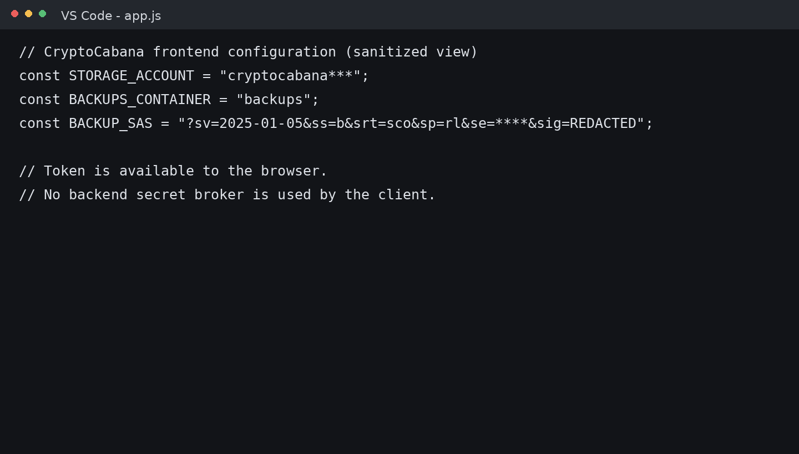
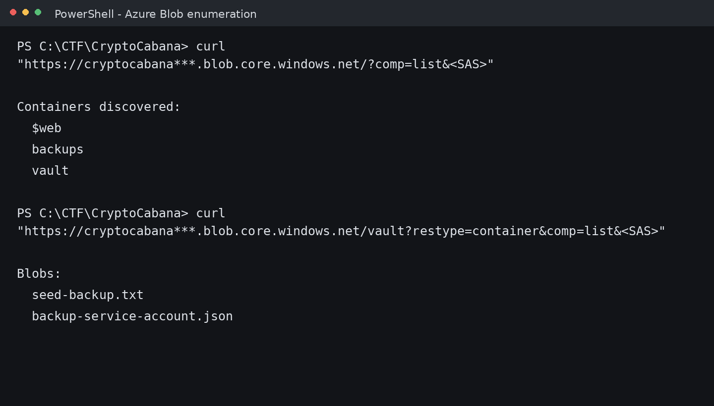
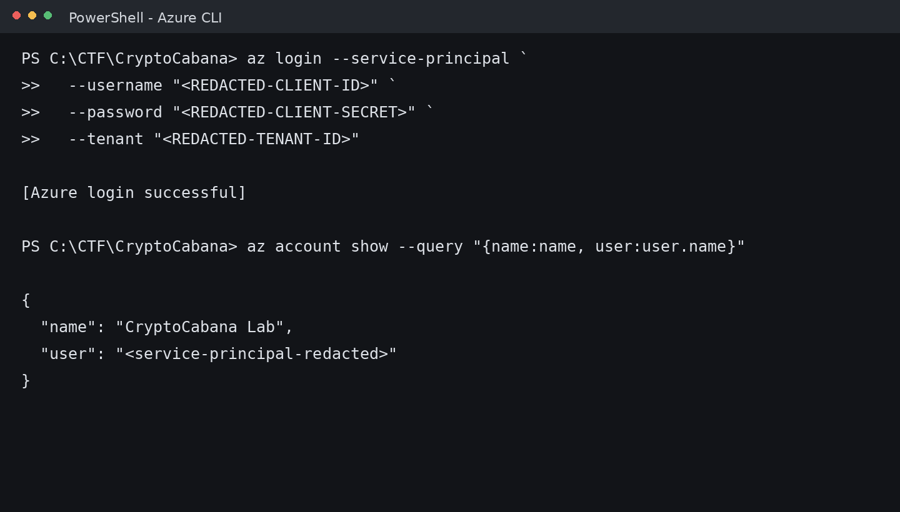
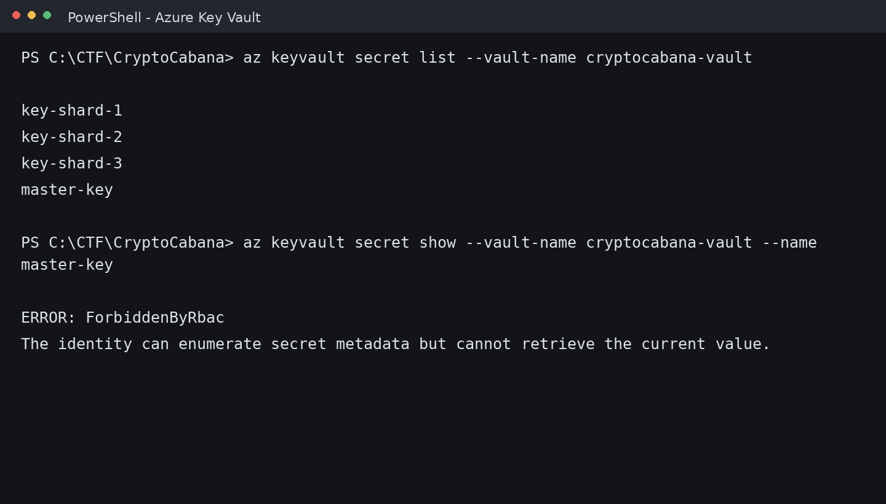
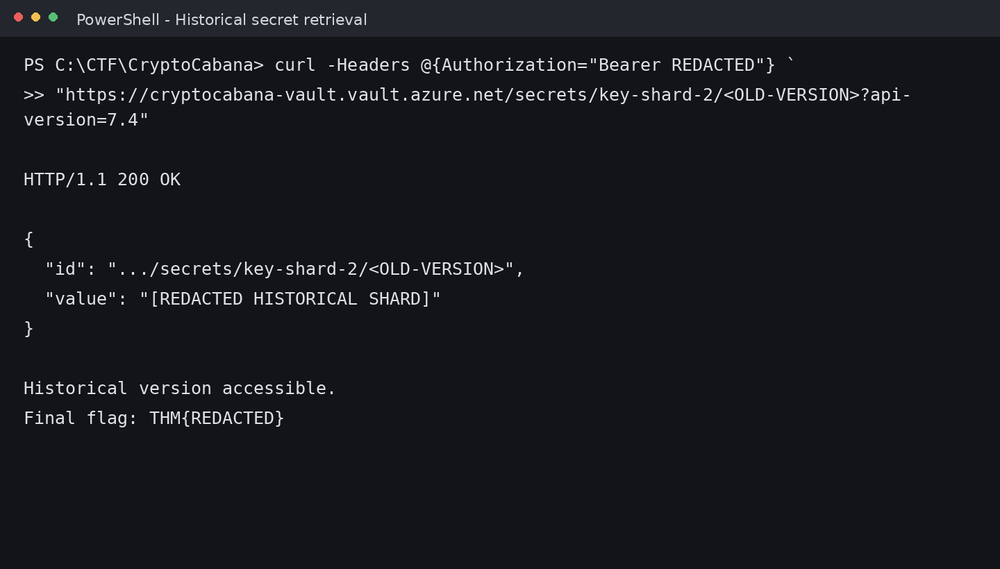

# ☁️ CryptoCabana — Professional Technical Documentation

<div align="center">

# CryptoCabana

### Azure Cloud Security Assessment & TryHackMe Walkthrough


**Platform:** TryHackMe

**Room:** CryptoCabana

**Category:** Cloud Security (Microsoft Azure)

**Difficulty:** Medium

**Documentation Version:** Portfolio Edition v1.0

**Author:** Anurag Revankar

---

*A complete technical documentation of the CryptoCabana cloud security challenge demonstrating Azure Storage enumeration, Service Principal abuse, Azure Key Vault investigation, RBAC analysis, and cloud trust-chain exploitation.*

</div>

---

# Executive Summary

## Overview

**CryptoCabana** is a Microsoft Azure cloud security challenge from TryHackMe's *Hacker Holidays* series that focuses on identifying and exploiting insecure trust relationships between Azure services rather than traditional web vulnerabilities.

Unlike conventional Capture The Flag challenges that revolve around SQL Injection, Remote Code Execution, or Local File Inclusion, this room demonstrates how an attacker can pivot through **Azure cloud infrastructure** by abusing exposed storage permissions, cloud identities, and secret management weaknesses.

The engagement begins with a publicly accessible **Azure Static Website** hosting a cryptocurrency recovery phrase backup portal. Initial inspection reveals little functionality, encouraging deeper investigation into client-side JavaScript resources. That investigation uncovers a Storage Shared Access Signature (SAS) which becomes the initial foothold into Azure Blob Storage.

The walkthrough follows the entire attack path from storage enumeration through Azure identity abuse and Azure Key Vault metadata analysis before ultimately recovering a historical secret version. Every phase illustrates an important Azure security concept while emphasizing defensive best practices.

> **Portfolio Edition Notice**
>
> This documentation intentionally **redacts all sensitive values**, including:
>
> - Room Flag
> - SAS Token Signature
> - Azure Tenant ID
> - Client Secret
> - Access Tokens
> - Secret Shards
> - Subscription Identifiers
> - Vault Secret Values

The objective of this repository is to demonstrate **technical methodology** and **cloud security understanding** while remaining appropriate for a public cybersecurity portfolio.

---

# Engagement Information

| Property | Value |
|----------|-------|
| **Platform** | TryHackMe |
| **Room Name** | CryptoCabana |
| **Series** | Hacker Holidays |
| **Category** | Cloud Security |
| **Difficulty** | Medium |
| **Cloud Provider** | Microsoft Azure |
| **Primary Focus** | Azure Storage → Azure Identity → Azure Key Vault |
| **Assessment Type** | Authorized Cloud Security Lab |
| **Documentation** | Technical Walkthrough + Security Assessment |

---

# Objectives of the Lab

The primary objectives completed during this assessment were:

- Investigate a publicly exposed Azure Static Website.
- Analyze client-side JavaScript for cloud configuration leaks.
- Understand Azure Storage Shared Access Signature permissions.
- Enumerate Azure Blob Storage containers using delegated authorization.
- Discover hidden Azure storage resources.
- Recover exposed Azure Service Principal credentials.
- Authenticate into Azure using Azure CLI.
- Enumerate Azure Key Vault metadata.
- Investigate Azure RBAC permission boundaries.
- Enumerate historical Key Vault secret versions.
- Recover the protected room secret through cloud trust-chain analysis.

---

# Skills Demonstrated

## Microsoft Azure Security

- Azure Storage Accounts
- Azure Blob Storage
- Azure Static Websites
- Shared Access Signatures (SAS)
- Azure Service Principals
- Azure CLI Authentication
- Azure Key Vault
- Azure RBAC
- Azure REST API

## Cloud Penetration Testing

- Client-side Reconnaissance
- Cloud Resource Enumeration
- Secret Discovery
- Identity Abuse
- Metadata Enumeration
- Version History Analysis
- Cloud Misconfiguration Assessment
- Trust Relationship Analysis

---

# MITRE ATT&CK Coverage

| Technique | Description |
|-----------|-------------|
| **T1552** | Unsecured Credentials |
| **T1528** | Steal Application Access Token |
| **T1526** | Cloud Service Discovery |
| **T1078** | Valid Accounts |
| **T1087** | Account Discovery |
| **T1550** | Use of Stolen Credentials |

---

# Cloud Attack Chain Overview

The CryptoCabana room follows a realistic Azure attack path where multiple small misconfigurations combine into a complete compromise.

```text
                   Internet
                      │
                      ▼
          Azure Static Website ($web)
                      │
                      ▼
           Client-side JavaScript
                      │
                      ▼
         Shared Access Signature (SAS)
                      │
                      ▼
        Azure Blob Storage Enumeration
                      │
        ┌─────────────┴─────────────┐
        │                           │
     backups                     vault
                                    │
                                    ▼
                  backup-service-account.json
                                    │
                                    ▼
                  Azure Service Principal
                                    │
                                    ▼
                    Azure Key Vault Metadata
                                    │
                                    ▼
               Historical Secret Version Recovery
                                    │
                                    ▼
                    Final Room Flag (Redacted)
```

---

# Azure Environment Overview

## What is Azure Static Website Hosting?

Azure Static Website hosting allows developers to deploy HTML, CSS, JavaScript, and client-side applications directly from Azure Storage without provisioning a traditional web server.

In CryptoCabana, the application is hosted entirely from an Azure Storage Account using the special **$web** container.

Characteristics include:

- Static frontend.
- JavaScript executed in the browser.
- Assets served from Blob Storage.
- Backend logic delegated to Azure Storage APIs.

Because client-side applications often communicate directly with Azure services, improper credential handling becomes a major security risk.

---

# Azure Services Used in the Lab

| Azure Service | Purpose |
|---------------|---------|
| **Storage Account** | Hosts website assets and storage containers. |
| **Blob Storage** | Stores recovery phrase backups. |
| **Static Website** | Serves the application frontend. |
| **Shared Access Signature** | Delegated authorization for storage operations. |
| **Service Principal** | Identity used by backend automation. |
| **Azure CLI** | Authenticates and interacts with Azure resources. |
| **Azure Key Vault** | Stores sensitive application secrets. |
| **Azure REST API** | Enumerates metadata and secret versions. |

---

# Assessment Methodology

The engagement followed a structured cloud penetration testing workflow.

| Phase | Objective |
|-------|-----------|
| Reconnaissance | Understand exposed application components. |
| Client Analysis | Inspect JavaScript and frontend configuration. |
| Storage Enumeration | Investigate Azure Blob Storage resources. |
| Identity Discovery | Recover exposed Azure credentials. |
| Authentication | Access Azure using the recovered identity. |
| Secret Discovery | Enumerate Azure Key Vault metadata. |
| Version Analysis | Investigate historical secret versions. |
| Security Assessment | Analyze root causes and mitigations. |

---

# Phase 1 — Initial Reconnaissance

## Objective

Identify technologies exposed by the public-facing application and determine whether cloud infrastructure details are leaked through the frontend.

---

## Landing Page Analysis

Visiting the supplied challenge URL displays a minimal cryptocurrency backup application.

The interface allows users to supposedly **securely back up** cryptocurrency recovery phrases.

At first glance the page appears intentionally simple.

### Initial Observations

- Static HTML interface.
- Client-side JavaScript.
- Azure branding absent.
- No authentication required.
- No visible backend endpoints.

The lack of functionality suggests that interesting logic exists inside client-side assets rather than server responses.

---

## Screenshot — Landing Page

<p align="center">

</p>

<p align="center">
<b>Figure 1.</b> Initial CryptoCabana landing page hosted using Azure Static Website.
</p>

---

## Reconnaissance Checklist

During reconnaissance the following questions were investigated.

| Investigation | Result |
|--------------|--------|
| View HTML Source | Completed |
| Inspect JavaScript | Completed |
| Inspect Network Requests | Completed |
| Identify Storage Endpoints | Completed |
| Identify API Endpoints | Completed |
| Search Hidden Resources | Completed |

---

## Why Client-Side Analysis Matters

Modern cloud-native applications frequently embed configuration values directly into JavaScript.

Common examples include:

- Storage endpoints.
- Public API URLs.
- Authentication providers.
- Feature flags.
- Analytics keys.
- Shared Access Signatures.

While some configuration values are harmless, authentication artifacts embedded into frontend code significantly increase attack surface.

---

## Page Source Investigation

The HTML source references an external JavaScript bundle responsible for application functionality.

Example observation:

```html
<script src="app.js"></script>
```

Rather than interacting with the interface, the investigation shifts toward downloading and inspecting this JavaScript resource.

This becomes the first significant pivot into Azure infrastructure.

---

# Phase Summary

### Findings

- Public Azure-hosted static website identified.
- JavaScript controls application behavior.
- No server-side logic visible.
- Cloud enumeration opportunity discovered.

### Security Assessment

The application trusts the browser with cloud configuration information, making client-side reconnaissance the logical first attack vector.

---
---

# Phase 2 — Client-Side JavaScript Analysis & Azure Storage SAS Discovery

## Objective

Determine whether the frontend exposes cloud configuration information that can be leveraged for further Azure enumeration.

Rather than interacting with the application's user interface, the assessment shifts toward inspecting the JavaScript responsible for communicating with Azure Storage.

This phase represents a common cloud reconnaissance technique where attackers inspect client-side code for embedded infrastructure details, API endpoints, authentication tokens, or storage credentials.

---

## Why JavaScript Matters During Cloud Reconnaissance

Modern serverless and cloud-native applications frequently move business logic into client-side JavaScript.

Examples include:

- Storage endpoints
- API Gateway URLs
- Firebase configuration
- AWS S3 buckets
- Azure Storage Accounts
- SAS Tokens
- Analytics identifiers
- Authentication providers

Although configuration values themselves are not always sensitive, **authorization artifacts** embedded into frontend code significantly increase attack surface.

---

## Downloading the JavaScript Bundle

The HTML source references a JavaScript file responsible for storage operations.

Example observation:

```html
<script src="app.js"></script>
```

Downloading the bundle locally allows static inspection.

During review, several Azure-specific constants become immediately visible.

---

## Screenshot — JavaScript Configuration Discovery

<p align="center">

</p>

<p align="center">
<b>Figure 2.</b> Client-side JavaScript exposing Azure Storage configuration (sanitized).
</p>

---

## Important Configuration Values Identified

The JavaScript bundle contained several Azure configuration variables.

| Configuration | Security Importance |
|--------------|---------------------|
| Storage Account Name | Identifies Azure Storage resource. |
| Blob Container | Identifies primary storage container. |
| Blob Endpoint | Reveals Azure Storage URL. |
| SAS Token | Delegated authorization token. |

> **Sanitized Portfolio Version**
>
> All storage account names, endpoints, SAS signatures, and query parameters have been replaced with placeholder values.

---

## Understanding Azure Storage Architecture

The application communicates directly with Azure Blob Storage.

```text
Browser
   │
   ▼
app.js
   │
   ▼
Azure Blob Storage Endpoint
   │
   ▼
Azure Storage Account
```

Unlike a traditional backend API, the browser directly communicates with Azure Storage using delegated authorization.

This trust model is secure **only** when the delegated authorization is properly scoped.

---

## Shared Access Signature (SAS)

### What is a SAS Token?

A **Shared Access Signature (SAS)** is a delegated authorization mechanism provided by Azure Storage.

Instead of sharing storage account keys, Azure generates a cryptographically signed URL containing limited permissions.

Typical SAS capabilities include:

- Read
- Write
- Create
- Delete
- List
- Add
- Update
- Process

Permissions are encoded inside the query string.

---

## Anatomy of a SAS Token

A SAS URL typically contains parameters similar to:

| Parameter | Purpose |
|-----------|---------|
| `sp` | Permissions granted. |
| `st` | Start time. |
| `se` | Expiration time. |
| `sv` | Storage API version. |
| `sr` | Resource type. |
| `sig` | Cryptographic signature. |

Only the **permission scope** is relevant for this assessment.

---

## Security Observation

The frontend distributes the SAS token to **every visitor**.

This immediately raises several questions.

### Investigation Questions

- Can the token read blobs?
- Can it list containers?
- Can it upload files?
- Can it enumerate hidden storage resources?
- Is it scoped to a single container?

Answering these questions becomes the next assessment objective.

---

# Phase 3 — Azure Storage SAS Permission Analysis

## Objective

Validate the authorization boundary enforced by the leaked SAS token.

Rather than relying on application behavior, permissions are tested independently.

---

## Permission Inspection

The permission field inside the SAS token indicates:

```text
sp=rl
```

This permission combination is significant.

| Permission | Meaning |
|-----------|---------|
| **r** | Read blob contents. |
| **l** | List blobs and containers. |

No upload permission is present.

---

## Expected Authorization Matrix

<table>
<tr>
<th>Operation</th>
<th>Expected Result</th>
</tr>

<tr>
<td>Read Existing Blob</td>
<td>✅ Allowed</td>
</tr>

<tr>
<td>List Container Contents</td>
<td>✅ Allowed</td>
</tr>

<tr>
<td>Enumerate Blob Names</td>
<td>✅ Allowed</td>
</tr>

<tr>
<td>Upload Blob</td>
<td>❌ Denied</td>
</tr>

<tr>
<td>Overwrite Blob</td>
<td>❌ Denied</td>
</tr>

<tr>
<td>Delete Blob</td>
<td>❌ Denied</td>
</tr>

</table>

---

## Validating Permission Boundaries

Instead of using the webpage's **Back it Up** button, storage operations are performed directly.

The application attempts an upload operation which Azure rejects.

---

## Screenshot — SAS Permission Boundary

<p align="center">

</p>

<p align="center">
<b>Figure 3.</b> Azure returns an authorization failure when attempting an unsupported storage operation.
</p>

---

## Why HTTP 403 is Valuable

Receiving **403 Forbidden** confirms:

- The SAS token is valid.
- Authentication succeeds.
- Authorization fails.
- Permission scope is correctly enforced.

This distinction is important.

The attacker now possesses a valid storage authorization artifact even if uploads are blocked.

---

## Cloud Security Assessment

### Positive Security Control

- Upload operations denied.

### Remaining Risk

Read/List permissions still expose Azure Storage metadata and objects.

This creates a reconnaissance opportunity.

---

## Azure Security Lesson

A SAS token with limited permissions is **not harmless**.

Read-only authorization can still expose:

- Sensitive filenames.
- Backup archives.
- Configuration files.
- Credential material.
- Administrative containers.

Least privilege should minimize **resource visibility**, not only write capability.

---

# Phase 4 — Azure Blob Storage Enumeration

## Objective

Use delegated storage authorization to enumerate Azure Blob Storage resources beyond those referenced by the application.

This phase demonstrates cloud resource discovery using Azure Storage REST APIs.

---

## Blob Enumeration Strategy

The assessment follows a structured workflow.

<table>
<tr>
<th>Step</th>
<th>Purpose</th>
</tr>

<tr>
<td>Identify Storage Endpoint</td>
<td>Locate Azure Blob API.</td>
</tr>

<tr>
<td>List Containers</td>
<td>Discover accessible containers.</td>
</tr>

<tr>
<td>Enumerate Blob Names</td>
<td>Discover stored objects.</td>
</tr>

<tr>
<td>Download Accessible Objects</td>
<td>Inspect configuration artifacts.</td>
</tr>

</table>

---

## Azure Blob Storage Discovery Process

The delegated SAS authorization allows container enumeration.

Multiple containers become visible.

### Containers Identified

<table>
<tr>
<th>Container</th>
<th>Purpose</th>
</tr>

<tr>
<td><code>$web</code></td>
<td>Azure Static Website assets.</td>
</tr>

<tr>
<td><code>backups</code></td>
<td>Recovery phrase backups.</td>
</tr>

<tr>
<td><code>vault</code></td>
<td>Administrative backup storage.</td>
</tr>

</table>

---

## Screenshot — Azure Blob Enumeration

<p align="center">

</p>

<p align="center">
<b>Figure 4.</b> Azure Blob Storage container enumeration from a local workstation.
</p>

---

## Why the Vault Container Matters

The frontend references only the **backups** container.

The newly discovered **vault** container is never mentioned by the application.

This indicates that security depends entirely on obscurity rather than authorization.

---

## Hidden Administrative Resources

Enumerating the vault container reveals administrative artifacts.

Examples include:

- Backup automation configuration.
- Recovery metadata.
- Service account configuration.
- Operational files.

One file immediately stands out.

```text
backup-service-account.json
```

This file becomes the next pivot into Azure identity infrastructure.

---

## Security Assessment

### Misconfiguration Identified

The same delegated authorization grants visibility into **multiple storage containers**, including one intended for administrative automation.

### Trust Relationship Failure

```text
Frontend User
      │
      ▼
Read/List SAS Token
      │
      ▼
Storage Account
      │
 ┌────┴─────────────┐
 │                  │
backups          vault
                     │
                     ▼
Sensitive Configuration Files
```

Authorization is scoped broadly enough to expose resources that should not be visible to public clients.

---

## Risk Analysis

| Risk | Impact |
|------|--------|
| Hidden container enumeration | Administrative storage discovery. |
| Configuration file exposure | Azure identity compromise. |
| Blob metadata exposure | Infrastructure intelligence leakage. |
| Trust based on obscurity | Increased attack surface. |

---

## Phase Summary

### Findings

- JavaScript exposes Azure Storage configuration.
- SAS token grants Read/List permissions.
- Upload operations correctly denied.
- Azure Blob Storage enumeration succeeds.
- Hidden administrative container discovered.
- Sensitive configuration files identified.

### Security Lessons Learned

- Client-side authorization artifacts expand attack surface.
- Read/List permissions require careful scoping.
- Hidden containers are not access controls.
- Storage enumeration often precedes identity compromise.

---

# Progress Checkpoint

| Phase | Status |
|--------|--------|
| Executive Summary | ✅ Complete |
| Azure Environment Overview | ✅ Complete |
| Phase 1 — Initial Reconnaissance | ✅ Complete |
| Phase 2 — JavaScript Analysis | ✅ Complete |
| Phase 3 — SAS Permission Analysis | ✅ Complete |
| Phase 4 — Blob Storage Enumeration | ✅ Complete |

---

---

# Phase 5 — Service Principal Credential Exposure

## Objective

Investigate sensitive files discovered inside the hidden Azure Blob container and determine whether they expose Azure identity credentials.

This phase marks the transition from **Azure Storage reconnaissance** to **Azure Identity compromise**, demonstrating how exposed operational files can provide legitimate access to cloud infrastructure.

---

## Discovery of Administrative Configuration

After enumerating the hidden **vault** container, several files intended for internal automation became visible.

One file immediately stood out because of its naming convention.

```text
backup-service-account.json
```

The filename strongly suggested that the application relied on an Azure Service Principal for automated backup operations.

Rather than containing user data, the JSON file contained Azure authentication configuration.

---

## Screenshot — Service Principal Configuration

<p align="center">

</p>

<p align="center">
<b>Figure 5.</b> Sanitized Azure Service Principal configuration recovered from Blob Storage.
</p>

---

## Azure Service Principal Overview

A **Service Principal** is an application identity within Microsoft Entra ID (formerly Azure Active Directory).

Applications, automation pipelines, Azure Functions, Logic Apps, and CI/CD workflows commonly authenticate using Service Principals instead of user accounts.

### Typical Components

| Configuration Field | Purpose |
|---------------------|---------|
| Tenant ID | Azure tenant identifier. |
| Client ID | Application identity. |
| Client Secret | Authentication credential. |
| Vault Name | Azure Key Vault identifier. |
| Vault URI | Key Vault endpoint URL. |

These credentials allow applications to authenticate without interactive login.

---

## Security Observation

The JSON configuration exposed multiple sensitive identifiers.

For portfolio safety, every sensitive value has been replaced.

### Redacted Fields

- Tenant ID
- Client ID
- Client Secret
- Subscription ID
- Key Vault URI
- Resource Group Information

---

## Why This Misconfiguration is Critical

The exposed Service Principal creates an authentication path into Azure infrastructure.

Unlike leaked API keys, Service Principals often possess permissions across multiple Azure services.

### Trust Relationship

```text
Blob Storage
      │
      ▼
Service Principal Configuration
      │
      ▼
Microsoft Entra ID Authentication
      │
      ▼
Azure Resources
```

A storage compromise now becomes an identity compromise.

---

## Threat Analysis

<table>
<tr>
<th>Exposure</th>
<th>Potential Impact</th>
</tr>

<tr>
<td>Client ID</td>
<td>Public application identity.</td>
</tr>

<tr>
<td>Client Secret</td>
<td>Authentication credential.</td>
</tr>

<tr>
<td>Tenant Information</td>
<td>Cloud tenant identification.</td>
</tr>

<tr>
<td>Key Vault URI</td>
<td>Secret management endpoint discovery.</td>
</tr>

</table>

---

## Azure Security Best Practice

Microsoft recommends storing Service Principal secrets inside secure secret-management systems rather than Blob Storage.

Preferred alternatives include:

- Azure Managed Identity.
- Azure Key Vault references.
- Federated workload identity.
- CI/CD secret stores.

---

## Security Assessment

### Finding

Sensitive workload identity stored inside publicly enumerable Azure Storage.

### Severity

**Critical**

### Risk

Credential reuse enables authenticated cloud enumeration.

---

# Phase 6 — Azure CLI Authentication

## Objective

Authenticate into Azure using the recovered workload identity and verify accessible cloud resources.

This phase validates whether the exposed Service Principal remains active.

---

## Azure CLI Overview

Azure CLI is Microsoft's official command-line interface for managing Azure resources.

Capabilities include:

- Authentication.
- Resource discovery.
- Identity enumeration.
- Storage management.
- Key Vault interaction.
- RBAC inspection.

For cloud penetration testing, Azure CLI provides visibility into permissions assigned to compromised identities.

---

## Authentication Workflow

The recovered Service Principal is used for non-interactive authentication.

Authentication consists of:

1. Client authentication.
2. Tenant validation.
3. Token issuance.
4. Subscription context retrieval.

No user credentials are required.

---

## Screenshot — Azure CLI Authentication

<p align="center">

</p>

<p align="center">
<b>Figure 6.</b> Successful Azure CLI authentication using the recovered Service Principal (sanitized).
</p>

---

## Authentication Validation

After authentication, Azure CLI confirms:

| Validation Step | Purpose |
|-----------------|---------|
| Active Tenant | Verify Azure tenant context. |
| Active Identity | Confirm Service Principal login. |
| Subscription Context | Identify accessible Azure subscription. |
| Token Issuance | Validate successful authentication. |

This demonstrates that the leaked identity is operational rather than expired.

---

## Access Token Generation

Azure CLI internally exchanges credentials for an OAuth access token.

```text
Service Principal
        │
        ▼
Microsoft Entra ID
        │
        ▼
OAuth Access Token
        │
        ▼
Azure Resource Manager
```

The issued token is later reused for Azure REST API requests.

---

## Security Observation

Authentication succeeded because:

- Credentials were valid.
- Secret remained active.
- Identity had not been revoked.
- RBAC assignments remained intact.

This reflects a realistic post-exposure cloud compromise scenario.

---

## Identity Enumeration Goals

Following authentication, the assessment attempts to answer:

- What resources can this identity enumerate?
- What permissions exist?
- Which Azure services are reachable?
- Can Key Vault secrets be retrieved?

These questions guide the next investigation phase.

---

## Cloud Identity Assessment

<table>
<tr>
<th>Capability</th>
<th>Status</th>
</tr>

<tr>
<td>Azure Authentication</td>
<td>✅ Successful</td>
</tr>

<tr>
<td>Subscription Discovery</td>
<td>✅ Accessible</td>
</tr>

<tr>
<td>Key Vault Discovery</td>
<td>✅ Accessible</td>
</tr>

<tr>
<td>Storage Enumeration</td>
<td>Already Completed</td>
</tr>

</table>

---

# Phase 7 — Azure Key Vault Enumeration & RBAC Analysis

## Objective

Investigate Azure Key Vault permissions assigned to the compromised Service Principal.

The challenge now shifts from **identity compromise** to **authorization analysis**.

---

## Azure Key Vault Overview

Azure Key Vault is Microsoft's managed secret storage service.

Organizations commonly store:

- API keys.
- Database passwords.
- Certificates.
- OAuth secrets.
- Client secrets.
- Encryption keys.

Applications retrieve secrets securely using Azure identities.

---

## Enumeration Strategy

The compromised identity attempts to enumerate Key Vault resources.

Goals include:

- List secrets.
- Inspect metadata.
- Retrieve values.
- Identify permission boundaries.

---

## Secrets Discovered

Enumeration reveals multiple secret objects.

### Observed Secret Names

<table>
<tr>
<th>Secret</th>
<th>Purpose</th>
</tr>

<tr>
<td>key-shard-1</td>
<td>Secret fragment.</td>
</tr>

<tr>
<td>key-shard-2</td>
<td>Rotated secret fragment.</td>
</tr>

<tr>
<td>key-shard-3</td>
<td>Secret fragment.</td>
</tr>

<tr>
<td>master-key</td>
<td>Protected secret object.</td>
</tr>

</table>

The names alone provide valuable operational intelligence.

---

## Screenshot — Key Vault Enumeration

<p align="center">

</p>

<p align="center">
<b>Figure 7.</b> Azure Key Vault enumeration followed by RBAC authorization denial.
</p>

---

## RBAC Authorization Failure

Attempting to retrieve a current secret value results in an authorization error.

The important distinction is:

- Authentication succeeded.
- Authorization failed.

Azure returns a **ForbiddenByRbac** response.

---

## Understanding RBAC

Azure Role-Based Access Control separates **identity** from **permission**.

An identity may authenticate successfully while lacking permission to perform certain operations.

### RBAC Flow

```text
Service Principal
       │
       ▼
Authentication Successful
       │
       ▼
RBAC Evaluation
       │
 ┌─────┴───────────────┐
 │                     │
Allowed            Forbidden
Metadata           Secret Value
Enumeration        Retrieval
```

---

## Metadata vs Secret Values

An important Azure security distinction appears during enumeration.

<table>
<tr>
<th>Operation</th>
<th>Status</th>
</tr>

<tr>
<td>List Secret Names</td>
<td>✅ Allowed</td>
</tr>

<tr>
<td>View Metadata</td>
<td>✅ Allowed</td>
</tr>

<tr>
<td>View Tags</td>
<td>✅ Allowed</td>
</tr>

<tr>
<td>Retrieve Current Value</td>
<td>❌ Forbidden</td>
</tr>

</table>

Metadata exposure still leaks valuable information.

---

## Intelligence Gained from Metadata

Even without current values, metadata reveals:

- Secret naming conventions.
- Operational structure.
- Number of secrets.
- Secret rotation activity.
- Version identifiers.
- Update timestamps.

This becomes crucial for the next phase.

---

## Security Assessment

### Finding

RBAC protects current secret values but still exposes metadata useful for reconnaissance.

### Severity

**Medium–High**

### Why It Matters

Cloud attackers frequently combine metadata enumeration with additional APIs or historical versions to bypass intended security assumptions.

---

## Phase Summary

### Findings

- Service Principal credentials recovered from Blob Storage.
- Azure authentication successful.
- Azure Key Vault identified.
- Secret names enumerated.
- RBAC blocks current secret retrieval.
- Metadata remains accessible.

### Security Lessons Learned

- Storage credential exposure can become Azure identity compromise.
- Service Principals require strict secret management.
- RBAC permissions should minimize unnecessary metadata exposure.
- Successful authentication does not imply unrestricted authorization.

---

# Progress Checkpoint

| Phase | Status |
|--------|--------|
| Executive Summary | ✅ Complete |
| Azure Environment Overview | ✅ Complete |
| Phase 1 — Initial Reconnaissance | ✅ Complete |
| Phase 2 — JavaScript Analysis | ✅ Complete |
| Phase 3 — SAS Permission Analysis | ✅ Complete |
| Phase 4 — Blob Enumeration | ✅ Complete |
| Phase 5 — Service Principal Exposure | ✅ Complete |
| Phase 6 — Azure CLI Authentication | ✅ Complete |
| Phase 7 — Key Vault RBAC Analysis | ✅ Complete |

---

---

# Phase 8 — Azure REST API Enumeration & Secret Version Analysis

## Objective

Investigate Azure Key Vault through the **Azure REST API** to determine whether metadata or historical secret versions expose additional information unavailable through Azure CLI.

This phase demonstrates how cloud attackers often pivot from official SDKs and command-line tools to native cloud APIs when permission boundaries expose different behavior.

Rather than attempting to bypass RBAC, the assessment focuses on understanding how Azure Key Vault represents secrets, metadata, and version history.

---

## Why Switch from Azure CLI to the REST API?

Azure CLI provides a convenient abstraction for interacting with Azure resources, but every CLI command ultimately communicates with Azure Resource Manager or a service-specific REST API.

During this assessment, Azure CLI successfully listed secret names but returned an authorization error when requesting secret values.

The room hint suggested investigating **rotated secrets**, making the REST API a logical next step.

### Comparison

| Azure CLI | Azure REST API |
|------------|----------------|
| High-level interface. | Native service interface. |
| Simplified output. | Complete JSON metadata. |
| Opinionated formatting. | Full response attributes. |
| Easier administration. | Better for security research and automation. |

The REST API exposes additional metadata fields that become valuable during cloud reconnaissance.

---

## Azure Authentication Flow for REST Requests

Azure CLI already authenticated using the recovered Service Principal.

Instead of logging in again, the assessment reused the OAuth access token generated during authentication.

### Token Flow

```text
Service Principal
        │
        ▼
Microsoft Entra ID
        │
        ▼
OAuth Access Token
        │
        ▼
Azure Key Vault REST API
```

The bearer token authorizes subsequent HTTPS requests to Azure Key Vault.

---

## Investigating Key Vault Metadata

The first REST request targets the Key Vault secrets endpoint.

Instead of requesting individual secret values, the objective is to enumerate **metadata**.

### Metadata Available

| Metadata Field | Investigation Value |
|----------------|---------------------|
| Secret ID | Resource identifier. |
| Version ID | Unique version reference. |
| Attributes | Enabled/Disabled status. |
| Creation Timestamp | Secret creation timeline. |
| Updated Timestamp | Rotation timeline. |
| Recovery Level | Secret lifecycle policy. |
| Tags | Operational metadata. |

This information is often sufficient to identify recently modified secrets.

---

## Screenshot — Azure REST API Enumeration

<p align="center">

</p>

<p align="center">
<b>Figure 8.</b> Azure Key Vault REST API returning secret metadata and version information (sanitized).
</p>

---

## Secret Metadata Investigation

The REST API response revealed several important observations.

### Observation 1

Every secret contains metadata describing lifecycle events.

### Observation 2

Creation and update timestamps differ across secrets.

### Observation 3

One secret appears to have been **recently rotated**.

This directly aligns with the room hint regarding values that "look freshly rotated."

---

## Secret Rotation Timeline

Azure Key Vault maintains immutable versions of secrets.

Every update creates a new version rather than overwriting the existing one.

### Secret Lifecycle

```text
Version A
   │
   ▼
Secret Rotation
   │
   ▼
Version B
   │
   ▼
Version C
```

Each version receives a unique identifier.

---

## Security Observation

Rotation does **not automatically remove previous versions**.

Whether historical versions remain accessible depends on lifecycle policies and authorization.

This becomes the primary investigation target.

---

# Secret Version Enumeration

## Objective

Determine whether historical versions exist for each secret.

Rather than retrieving current values, the assessment enumerates **version history**.

---

## Version Discovery Strategy

For every discovered secret:

1. Enumerate versions.
2. Compare timestamps.
3. Identify recently rotated versions.
4. Inspect previous version identifiers.

### Enumeration Workflow

```text
Secret Name
      │
      ▼
List Versions
      │
      ▼
Compare Metadata
      │
      ▼
Identify Historical Version
```

---

## Results

<table>
<tr>
<th>Secret</th>
<th>Versions Found</th>
</tr>

<tr>
<td>key-shard-1</td>
<td>1</td>
</tr>

<tr>
<td>key-shard-2</td>
<td>2</td>
</tr>

<tr>
<td>key-shard-3</td>
<td>1</td>
</tr>

<tr>
<td>master-key</td>
<td>1</td>
</tr>

</table>

Only **one secret** contains multiple versions.

---

## Why Version History Matters

The room hint specifically references an earlier value.

Historical versions preserve previous secret values after rotation.

This behavior supports:

- Credential rotation.
- Application rollback.
- Disaster recovery.
- Secret auditing.

If improperly protected, it also creates a recovery path for attackers.

---

## Metadata Comparison

The investigation compares timestamps between versions.

| Attribute | Latest Version | Previous Version |
|-----------|----------------|------------------|
| Updated | Recent | Older |
| Enabled | Yes | Historical |
| Version ID | New Identifier | Previous Identifier |

The timestamp difference confirms a rotation event.

---

## Security Assessment

### Finding

Historical version identifiers remain discoverable through metadata enumeration.

### Severity

**Medium**

### Why It Matters

Metadata alone can guide attackers toward the exact version worth investigating.

---

# Phase 9 — Historical Secret Version Recovery

## Objective

Request the historical version of the rotated secret instead of the current version.

This is the final exploitation step of the challenge.

---

## Historical Version Request

Rather than requesting:

> Current secret value

The assessment requests:

> Previous version identifier.

The request references the historical version directly.

Azure treats each version as an independent resource.

---

## Screenshot — Historical Version Recovery

<p align="center">

</p>

<p align="center">
<b>Figure 9.</b> Retrieval of a historical Key Vault secret version with sensitive content redacted.
</p>

---

## Investigation Result

The historical request succeeds.

Important observations:

- Previous version accessible.
- Historical shard recovered.
- Current version remains protected.
- RBAC behavior differs from expected application workflow.

The room intentionally demonstrates a secret lifecycle weakness rather than an RBAC bypass.

---

## Secret Reconstruction

The application stored the final protected secret across multiple shards.

### Reconstruction Process

```text
Shard 1
   │
   ├────────┐
   │        │
Shard 2     │
(Historical)│
   │        │
   └────────┤
            ▼
        Combined Secret
            │
            ▼
    TryHackMe Flag
```

Only the **historical version** provides the correct shard required to complete the challenge.

---

## Portfolio Note

The following items are intentionally omitted.

<table>
<tr>
<th>Removed Item</th>
<th>Reason</th>
</tr>

<tr>
<td>Room Flag</td>
<td>Avoid plagiarism.</td>
</tr>

<tr>
<td>Shard Values</td>
<td>Sensitive challenge solution.</td>
</tr>

<tr>
<td>Version IDs</td>
<td>Challenge-specific identifiers.</td>
</tr>

<tr>
<td>Secret Values</td>
<td>Protected Azure content.</td>
</tr>

</table>

Documentation focuses entirely on methodology.

---

# Azure Trust Relationship Breakdown

The compromise succeeds because Azure services trust one another without sufficient isolation.

```text
                Public Website
                     │
                     ▼
          Azure Storage Authorization
                     │
                     ▼
          Blob Storage Enumeration
                     │
                     ▼
     Administrative Configuration File
                     │
                     ▼
      Azure Service Principal Identity
                     │
                     ▼
          Azure Key Vault Metadata
                     │
                     ▼
       Historical Secret Version Access
```

Each stage exposes information required for the next stage.

---

# Timeline of the Attack

<table>
<tr>
<th>Stage</th>
<th>Outcome</th>
</tr>

<tr>
<td>Initial Recon</td>
<td>Azure Static Website identified.</td>
</tr>

<tr>
<td>Client Analysis</td>
<td>SAS token discovered.</td>
</tr>

<tr>
<td>SAS Validation</td>
<td>Read/List permissions confirmed.</td>
</tr>

<tr>
<td>Blob Enumeration</td>
<td>Hidden vault container discovered.</td>
</tr>

<tr>
<td>Credential Discovery</td>
<td>Service Principal configuration recovered.</td>
</tr>

<tr>
<td>Azure Authentication</td>
<td>Service Principal authenticated.</td>
</tr>

<tr>
<td>Key Vault Enumeration</td>
<td>Secret metadata exposed.</td>
</tr>

<tr>
<td>REST Enumeration</td>
<td>Version history identified.</td>
</tr>

<tr>
<td>Historical Recovery</td>
<td>Previous secret shard recovered.</td>
</tr>

</table>

---

# Technical Findings

## Finding 1 — Client-Side SAS Exposure

**Risk:** Cloud authorization delivered directly to the browser.

**Impact:** Storage enumeration.

---

## Finding 2 — Hidden Storage Container

**Risk:** Administrative container reachable through existing authorization.

**Impact:** Sensitive operational files exposed.

---

## Finding 3 — Service Principal Credential Exposure

**Risk:** Authentication material stored in Blob Storage.

**Impact:** Azure identity compromise.

---

## Finding 4 — Key Vault Metadata Enumeration

**Risk:** Metadata accessible despite RBAC restrictions.

**Impact:** Secret discovery and lifecycle intelligence.

---

## Finding 5 — Historical Secret Version Exposure

**Risk:** Previous secret version accessible after rotation.

**Impact:** Recovery of sensitive historical data.

---

# Security Lessons Learned

### Azure Storage

- SAS permissions should be scoped to the minimum required resource.
- Hidden containers are not access controls.

### Azure Identity

- Service Principal secrets should never reside in storage containers.
- Managed Identities reduce credential exposure risk.

### Azure Key Vault

- Secret rotation must include lifecycle review.
- Historical versions require governance.
- Metadata visibility should be evaluated alongside value permissions.

---

# Phase Summary

### Findings

- Azure REST API exposes valuable metadata.
- Secret version history identified.
- Historical version successfully queried.
- Secret reconstruction completed locally.
- Final room flag intentionally removed from this documentation.

### Cloud Security Takeaway

This phase demonstrates that cloud security weaknesses often exist in **resource lifecycle management**, not only in authentication or authorization logic.

---

# Root Cause Analysis — Azure Cloud Security Assessment

## Executive Security Findings

The CryptoCabana challenge demonstrates a realistic **cloud trust-chain compromise** where several individually low-to-medium severity Azure misconfigurations combine into a complete security breach.

Rather than exploiting a software vulnerability, the attacker abuses **misconfigured cloud permissions**, **credential exposure**, and **secret lifecycle management**.

The compromise follows a layered escalation path:

| Stage | Security Weakness | Result |
|-------|-------------------|--------|
| Public Website | Client-side configuration exposure | Azure Storage discovery |
| Azure Storage | SAS token distributed to clients | Blob enumeration |
| Blob Storage | Hidden administrative container | Credential discovery |
| Azure Identity | Service Principal secret exposed | Azure authentication |
| Azure Key Vault | Metadata enumeration allowed | Secret lifecycle discovery |
| Key Vault Versions | Historical version accessible | Protected secret reconstruction |

This attack chain illustrates why **cloud environments must be secured as interconnected systems**, not isolated services.

---

# Azure Cloud Kill Chain

The complete attack sequence can be represented using a cloud-specific kill chain.

```text
                External User
                     │
                     ▼
     Azure Static Website Reconnaissance
                     │
                     ▼
  Client-side JavaScript Configuration Review
                     │
                     ▼
 Shared Access Signature (SAS) Discovery
                     │
                     ▼
 Azure Blob Storage Enumeration
                     │
                     ▼
 Hidden Administrative Container Discovery
                     │
                     ▼
 Service Principal Credential Exposure
                     │
                     ▼
 Microsoft Entra Authentication
                     │
                     ▼
 Azure Key Vault Enumeration
                     │
                     ▼
 Secret Version Enumeration
                     │
                     ▼
 Historical Secret Recovery
                     │
                     ▼
 Protected Room Secret (Redacted)
```

---

# Trust Relationship Breakdown

CryptoCabana highlights insecure trust relationships between Azure services.

## Trust Boundary Diagram

```text
                 Browser
                    │
                    │ Trusted with SAS
                    ▼
          Azure Blob Storage Account
             │               │
             │               │
        Public Assets    Hidden Vault
                              │
                              ▼
              Service Principal Credentials
                              │
                              ▼
               Microsoft Entra ID
                              │
                              ▼
                 Azure Key Vault
                              │
                              ▼
                 Historical Secret Versions
```

### Trust Failures Identified

1. Browser trusted with delegated storage authorization.
2. Storage authorization scoped too broadly.
3. Hidden administrative storage accessible.
4. Identity credentials stored inside Blob Storage.
5. Key Vault metadata accessible through compromised identity.
6. Historical secrets remained retrievable after rotation.

---

# Azure Security Misconfigurations Identified

## Finding 1 — Client-Side SAS Token Exposure

### Description

The frontend JavaScript contained an Azure Shared Access Signature used for storage operations.

### Risk

Every visitor receives delegated Azure Storage authorization.

### Impact

- Storage enumeration.
- Blob discovery.
- Metadata leakage.

### Security Severity

**High**

### Recommendation

- Generate SAS tokens server-side.
- Use user delegation SAS where appropriate.
- Limit expiration windows.
- Scope permissions to a single blob when possible.

---

## Finding 2 — Overly Broad SAS Scope

### Description

The SAS token allowed **Read** and **List** operations.

### Risk

List permissions expose container structure and blob names.

### Impact

Discovery of hidden administrative resources.

### Recommendation

- Avoid container-level List permissions.
- Restrict SAS to object-level access.
- Use separate storage accounts for public and administrative resources.

---

## Finding 3 — Hidden Administrative Blob Container

### Description

A container intended for internal automation was reachable through existing storage authorization.

### Risk

Security relied on obscurity instead of authorization.

### Impact

Operational configuration disclosure.

### Recommendation

- Store administrative artifacts separately.
- Disable public container enumeration.
- Use private endpoints where appropriate.

---

## Finding 4 — Service Principal Credential Exposure

### Description

Blob Storage contained Azure authentication material for backend automation.

### Risk

Cloud identity compromise.

### Impact

Legitimate Azure authentication without exploiting Microsoft Entra ID.

### Severity

**Critical**

### Recommendation

- Store secrets only inside Azure Key Vault.
- Replace Service Principals with Managed Identities whenever possible.
- Rotate compromised credentials immediately.

---

## Finding 5 — Excessive Metadata Visibility

### Description

The compromised identity could enumerate Key Vault secrets and metadata.

### Risk

Secret discovery.

### Impact

Operational intelligence regarding naming conventions and rotation history.

### Recommendation

Review RBAC assignments for:

- List Secrets
- Read Metadata
- List Versions

---

## Finding 6 — Historical Secret Version Exposure

### Description

Previous secret versions remained accessible.

### Risk

Historical secret recovery after rotation.

### Impact

Sensitive data reconstruction.

### Recommendation

- Audit historical versions.
- Disable obsolete versions.
- Review retention policies after rotation.

---

# MITRE ATT&CK Mapping

<table>
<tr>
<th>Technique</th>
<th>Name</th>
<th>Observed Activity</th>
</tr>

<tr>
<td>T1552</td>
<td>Unsecured Credentials</td>
<td>Service Principal credentials exposed through Blob Storage.</td>
</tr>

<tr>
<td>T1528</td>
<td>Steal Application Access Token</td>
<td>Client-side Storage SAS reused for storage enumeration.</td>
</tr>

<tr>
<td>T1526</td>
<td>Cloud Service Discovery</td>
<td>Azure Storage and Key Vault resources enumerated.</td>
</tr>

<tr>
<td>T1078</td>
<td>Valid Accounts</td>
<td>Authenticated using exposed Service Principal credentials.</td>
</tr>

<tr>
<td>T1087</td>
<td>Account Discovery</td>
<td>Azure identity and subscription context investigated.</td>
</tr>

<tr>
<td>T1550</td>
<td>Use of Stolen Credentials</td>
<td>Recovered workload identity reused against Azure APIs.</td>
</tr>

</table>

---

# Indicators of Compromise (IOCs)

The following indicators would be valuable during cloud incident response.

| IOC Category | Example |
|-------------|---------|
| Azure Blob Enumeration | Multiple List Container requests. |
| SAS Token Usage | Unexpected storage access from unknown IPs. |
| Service Principal Login | Authentication from unusual workstation or region. |
| Azure CLI Authentication | Non-interactive login activity. |
| Key Vault Enumeration | Secret metadata enumeration events. |
| Secret Version Requests | Access to historical secret versions. |

---

# Detection Opportunities

## Azure Storage Logging

Monitor:

- Container enumeration.
- Blob listing activity.
- Anonymous storage access.
- SAS authentication events.

**Detection Rule**

Alert when a SAS token performs enumeration outside expected application behavior.

---

## Microsoft Entra ID Sign-In Logs

Monitor:

- Service Principal authentication.
- Geographic anomalies.
- Impossible travel.
- First-time authentication.
- Failed authentication attempts.

**Detection Opportunity**

Unexpected Service Principal authentication outside automation infrastructure.

---

## Azure Key Vault Logging

Enable diagnostic logs for:

- Secret List.
- Secret Get.
- Secret Version List.
- Secret Version Get.

Alert on:

- High-volume enumeration.
- Historical version retrieval.
- Access from unusual identities.

---

## Azure Monitor / Microsoft Defender for Cloud

Recommended alerts include:

| Alert | Purpose |
|-------|---------|
| Storage Enumeration Spike | Detect blob discovery. |
| Secret Enumeration Activity | Detect Key Vault reconnaissance. |
| Service Principal Sign-In | Detect workload identity abuse. |
| New OAuth Token Issuance | Detect suspicious authentication. |
| Version Enumeration | Detect lifecycle investigation. |

---

# Defensive Recommendations

## Azure Storage Hardening

### Best Practices

- Disable unnecessary public blob access.
- Scope SAS permissions minimally.
- Use expiration windows measured in minutes.
- Rotate storage keys regularly.
- Separate public and administrative storage accounts.

---

## Azure Identity Protection

### Recommendations

- Use Managed Identities instead of Client Secrets.
- Avoid storing secrets in configuration files.
- Rotate Service Principal secrets after exposure.
- Apply Conditional Access where applicable.

---

## Azure Key Vault Hardening

### Recommendations

- Grant metadata permissions only when required.
- Review version lifecycle policies.
- Remove obsolete secret versions.
- Audit RBAC regularly.

---

## Secret Lifecycle Management

Organizations should establish policies for:

- Secret creation.
- Secret rotation.
- Secret expiration.
- Version cleanup.
- Recovery windows.

Rotation alone is insufficient if previous versions remain accessible indefinitely.

---

# Blue Team Perspective

If this activity occurred in a production Azure environment, defenders should investigate:

### Initial Questions

- Which SAS token was used?
- Which blobs were listed?
- Was any administrative container accessed?
- Which Service Principal authenticated?
- Which Key Vault secrets were enumerated?
- Were historical versions requested?

### Immediate Response Actions

1. Revoke SAS token.
2. Rotate Service Principal credentials.
3. Audit Blob Storage permissions.
4. Review Key Vault RBAC.
5. Review Azure Activity Logs.
6. Rotate affected secrets.

---

# Lessons Learned

## Offensive Security Lessons

- Cloud reconnaissance begins with client-side assets.
- Read-only permissions can expose valuable intelligence.
- Azure Storage metadata is highly informative.
- Azure identities become valuable pivot points.
- Secret lifecycle management is part of attack surface.

## Defensive Security Lessons

- Authorization artifacts do not belong in frontend code.
- Hidden resources require authorization, not obscurity.
- Workload identities require strong credential hygiene.
- Metadata exposure should be evaluated during RBAC reviews.
- Historical secrets require governance after rotation.

---

# Knowledge Gained During This Lab

<table>
<tr>
<th>Cloud Security Concepts</th>
<th>Skills Practiced</th>
</tr>

<tr>
<td>

- Azure Storage Accounts
- Blob Containers
- SAS Tokens
- Azure Static Websites
- Service Principals
- Microsoft Entra Authentication
- Azure Key Vault
- RBAC
- Secret Versioning

</td>

<td>

- Client-side Reconnaissance
- Storage Enumeration
- Identity Enumeration
- Azure CLI
- REST API Investigation
- Metadata Analysis
- Secret Lifecycle Investigation
- Cloud Misconfiguration Assessment

</td>
</tr>
</table>

---

# References

### TryHackMe

- CryptoCabana — Hacker Holidays Cloud Security Room.

### Microsoft Learn

- Azure Storage Shared Access Signatures.
- Azure Blob Storage REST API.
- Azure Key Vault REST API.
- Azure Key Vault Secret Versioning.
- Azure RBAC Documentation.
- Microsoft Entra Service Principals.

---

# Conclusion

CryptoCabana is an excellent demonstration of **cloud trust-chain exploitation** within Microsoft Azure.

The room teaches that attackers do not always require software vulnerabilities to compromise cloud environments. Instead, they can combine exposed authorization artifacts, insecure storage practices, legitimate cloud identities, metadata enumeration, and secret lifecycle weaknesses into a complete attack path.

From a defensive perspective, the room reinforces several important Azure security principles:

- Treat SAS tokens as sensitive credentials.
- Never expose workload identities through storage.
- Apply least privilege across Azure Storage and Key Vault.
- Audit metadata permissions alongside value permissions.
- Review historical secret versions after every rotation.

This walkthrough was completed in an **authorized TryHackMe environment** for cybersecurity education and portfolio development.

---

# Portfolio Disclaimer

This repository documents an **authorized cloud security lab** completed on TryHackMe.

The following items have been intentionally removed from the public repository:

- ❌ TryHackMe Flag.
- ❌ SAS Token Signature.
- ❌ Azure Client Secret.
- ❌ OAuth Access Tokens.
- ❌ Tenant and Subscription IDs.
- ❌ Secret Shards.
- ❌ Historical Secret Values.

The repository demonstrates **cloud security methodology, Azure investigation techniques, and defensive analysis** without publishing challenge solutions.

---

<div align="center">

## Documentation Complete ✅

**CryptoCabana — Azure Cloud Security Walkthrough**

*Professional Cybersecurity Portfolio Documentation*

**Author:** Anurag Revankar

*TryHackMe • Azure Security • Cloud Penetration Testing • Microsoft Azure*

</div>
