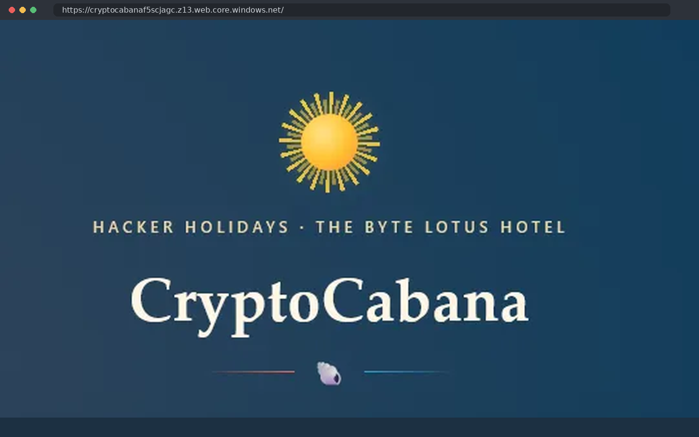

# CryptoCabana - TryHackMe Walkthrough

> Professional cloud-security documentation for the **TryHackMe CryptoCabana** room.
>
> **Flags, live credentials, SAS signatures, access tokens, and recovered secret values are intentionally redacted** to keep this repository suitable for a portfolio and reduce copy-paste plagiarism.



## Overview

CryptoCabana is a medium-difficulty Azure cloud-security challenge built around a chained trust relationship between an Azure Static Website, Blob Storage, a leaked service identity, and Azure Key Vault.

The investigation follows:

`Static Website -> client-side configuration -> SAS authorization -> Blob enumeration -> service-principal exposure -> Azure authentication -> Key Vault metadata -> secret-version history -> shard reconstruction`

## Skills Demonstrated

- Azure Static Website reconnaissance
- Client-side configuration review
- Azure Storage SAS analysis
- Blob container/object enumeration
- Azure CLI service-principal authentication
- Azure Key Vault RBAC analysis
- Azure Key Vault REST API usage
- Secret-version enumeration
- Cloud misconfiguration analysis
- Secure portfolio reporting and redaction

## Repository Layout

```text
CryptoCabana-TryHackMe-Walkthrough/
├── Documentation/
│   └── Documentation.md
├── Resources/
│   └── notes.md
├── Screenshots/
│   ├── 01_cryptocabana_landing.png
│   ├── 02_frontend_appjs.png
│   ├── 03_sas_permissions_403.png
│   ├── 04_blob_container_enum.png
│   ├── 05_service_principal_json.png
│   ├── 06_azure_login.png
│   ├── 07_keyvault_rbac.png
│   ├── 08_rest_secret_versions.png
│   └── 09_historical_version.png
├── docs/
│   └── index.md
├── README.md
└── _config.yml
```

## Investigation Summary

### 01 - Reconnaissance
The target is an Azure Static Website. The interface exposes little useful data, making client-side inspection the first high-value action.

### 02 - Frontend Review
The JavaScript bundle contains storage configuration and a SAS token. Real challenge values are redacted in this repository.

### 03 - SAS Analysis
The observed signed-permissions field is `sp=rl`, representing read/list capability. A write attempt returns HTTP 403, confirming the boundary.

### 04 - Storage Enumeration
Direct Blob interaction reveals an additional `vault` container that is not referenced by the kiosk UI.

### 05 - Credential Exposure
A service-account configuration file in the hidden container contains Azure service-principal material and Key Vault details.

### 06 - Azure Authentication
The recovered lab identity authenticates through Azure CLI. All identifiers are sanitized here.

### 07 - Key Vault Boundary
Secret enumeration succeeds, while direct current-value retrieval is blocked by RBAC.

### 08 - Version History
The Key Vault REST API reveals secret-version metadata. One shard has multiple revisions, matching the room hint about rotation.

### 09 - Historical Retrieval
The older revision can be requested directly in the lab, returning the missing shard material. The final flag is omitted.

## Defensive Takeaways

The challenge demonstrates why cloud security must be evaluated as an end-to-end trust chain. Browser-visible authorization, storage exposure, credential placement, identity privileges, and secret lifecycle controls interact.

## Flag Policy

This repository deliberately does **not** publish the live TryHackMe flag, real SAS signatures, client secrets, access tokens, or exact recovered shard contents.

## Documentation

- [Full technical documentation](Documentation/Documentation.md)
- [Quick notes](Resources/notes.md)
- [GitHub Pages documentation](docs/index.md)

## References

- [TryHackMe - CryptoCabana](https://tryhackme.com/room/hh-cryptocabana-f81cac95)
- [Microsoft Learn - Create a Service SAS](https://learn.microsoft.com/en-us/rest/api/storageservices/create-service-sas)
- [Microsoft Learn - Azure Key Vault REST API](https://learn.microsoft.com/en-us/rest/api/keyvault/)
- [Microsoft Learn - Get Secret](https://learn.microsoft.com/en-us/rest/api/keyvault/secrets/get-secret/get-secret?view=rest-keyvault-secrets-2025-07-01)
- [Microsoft Learn - Get Secret Versions](https://learn.microsoft.com/en-us/rest/api/keyvault/secrets/get-secret-versions/get-secret-versions?view=rest-keyvault-secrets-2025-07-01)

---

**Portfolio note:** Screenshots are sanitized local lab-style visuals. Sensitive values are never published.
