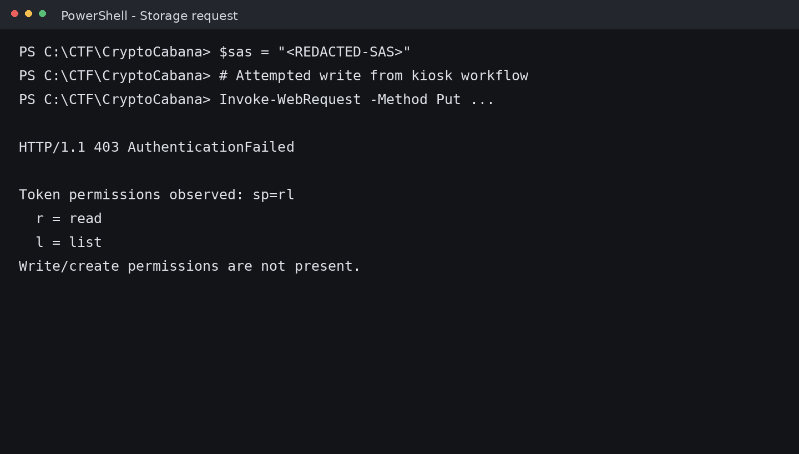
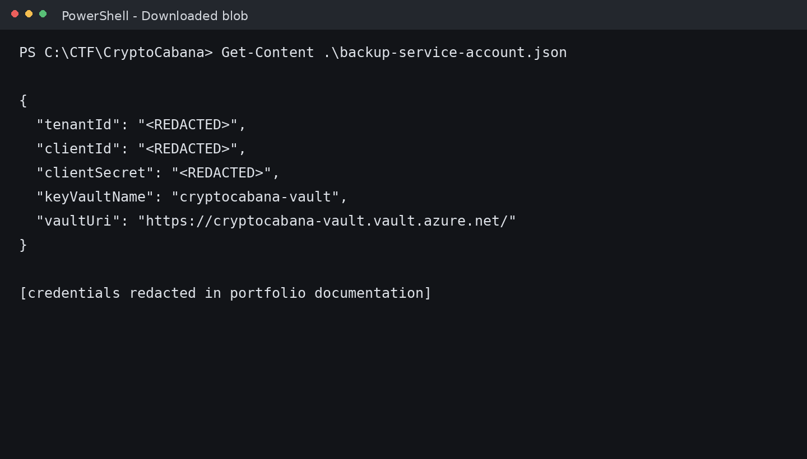
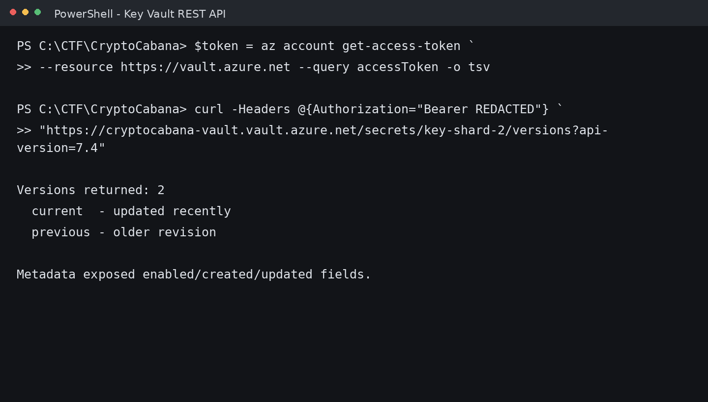

# CryptoCabana
## TryHackMe - Azure Cloud Security Case Study

> **Medium • Cloud / Azure • Portfolio Edition**
>
> Flags, credentials, tokens, and exact recovered secret values are intentionally redacted.


## Overview

CryptoCabana is a cloud-security challenge centered on an Azure Static Website backed by Blob Storage and Azure Key Vault.

The investigation is best understood as a trust-chain analysis:

**Browser-visible configuration -> SAS authorization -> Blob enumeration -> credential exposure -> service-principal authentication -> Key Vault discovery -> secret version history -> historical shard recovery**

## Contents

| Section | Focus |
|---|---|
| Executive Summary | Challenge context and high-level attack chain |
| Reconnaissance | Azure Static Website and client-side review |
| SAS Analysis | Permission discovery and 403 validation |
| Blob Enumeration | Discovery of the hidden vault container |
| Service Identity | Recovery of sanitized service-principal configuration |
| Azure Authentication | Login and identity verification |
| Key Vault | RBAC boundary and secret enumeration |
| REST API | Secret version discovery |
| Historical Retrieval | Older revision analysis |
| Findings | Root cause and defensive controls |
| MITRE Mapping | ATT&CK technique mapping |

## Attack Chain

```text
Azure Static Website
        |
        v
Client-side JavaScript
        |
        v
SAS read/list access
        |
        v
Blob container discovery
        |
        v
Hidden vault container
        |
        v
Service-principal configuration
        |
        v
Azure CLI authentication
        |
        v
Key Vault enumeration
        |
        v
RBAC boundary
        |
        v
REST API version discovery
        |
        v
Historical secret version
        |
        v
Shard reconstruction
        |
        v
FLAG - REDACTED
```

## Evidence Gallery

### 1. Initial Reconnaissance


The target presents as a simple Azure Static Website.

### 2. Client-Side Review


The JavaScript exposes storage configuration and a SAS token.

### 3. SAS Permission Validation


The observed permission field is `sp=rl`; the write workflow receives a 403.

### 4. Blob Enumeration


Storage enumeration exposes the application containers plus an additional `vault` container.

### 5. Service Identity Exposure


The hidden vault contains `backup-service-account.json`; credentials are redacted.

### 6. Azure Login


The recovered service identity authenticates to the lab through Azure CLI.

### 7. Key Vault RBAC


Secret names can be enumerated while direct retrieval is denied.

### 8. Secret Version Analysis


The REST API reveals two versions for the relevant shard.

### 9. Historical Retrieval


The previous version returns the historical shard in the lab; the shard and final flag are redacted.

## Findings

| Finding | Security significance |
|---|---|
| Client-visible SAS | Storage authorization becomes discoverable to visitors. |
| Broad storage enumeration | A non-UI container becomes reachable. |
| Credential exposure | Blob data contains service identity material. |
| Key Vault discovery rights | Secret metadata becomes available to the recovered identity. |
| Historical version exposure | A previous revision remains useful after rotation. |

## Defensive Perspective

A resilient cloud design would:

- keep durable credentials server-side;
- use least-privilege storage authorization;
- prefer Entra ID and managed/workload identities where practical;
- restrict Key Vault operations to exact required permissions;
- review historical secret versions as part of rotation;
- monitor storage, identity, and Key Vault enumeration.

## Full Technical Report

[Open Documentation/Documentation.md](../Documentation/Documentation.md)

## Author

**Anurag R.**  
Cybersecurity | Cloud Security | Azure | CTF Research

## Disclaimer

All testing described here is limited to the authorized TryHackMe lab environment. Use these techniques only where explicit permission exists.
