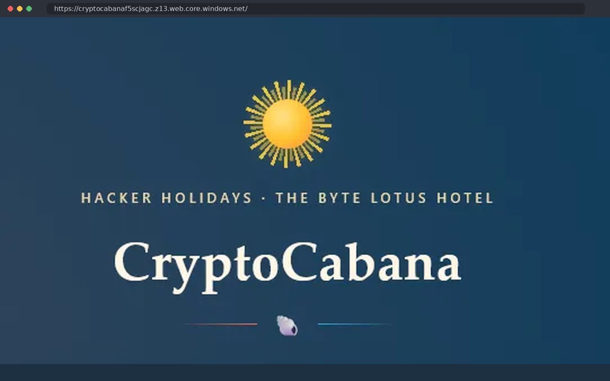
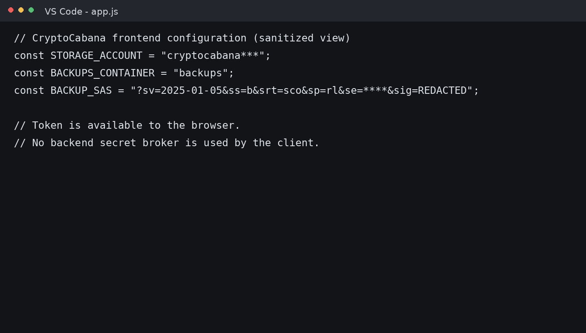
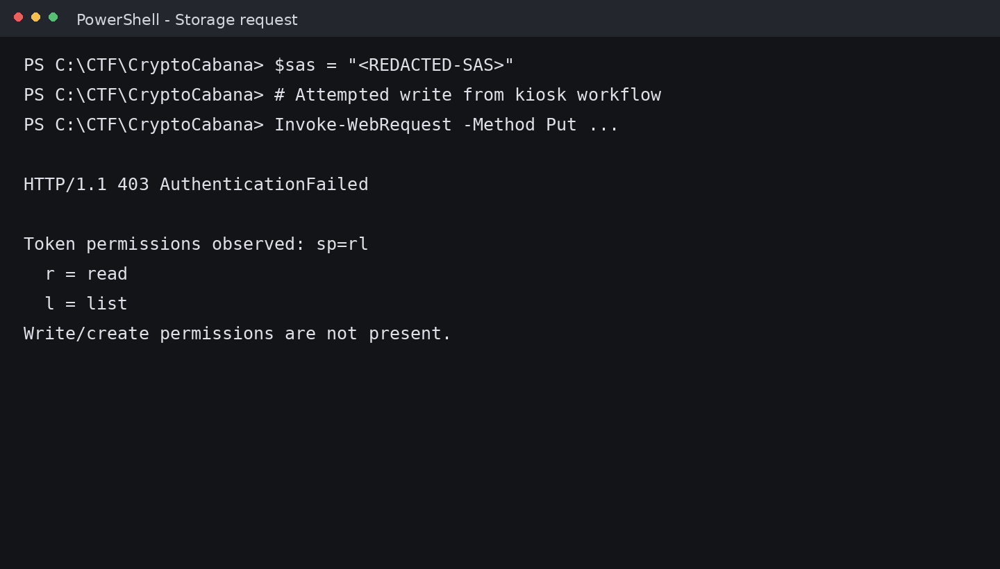
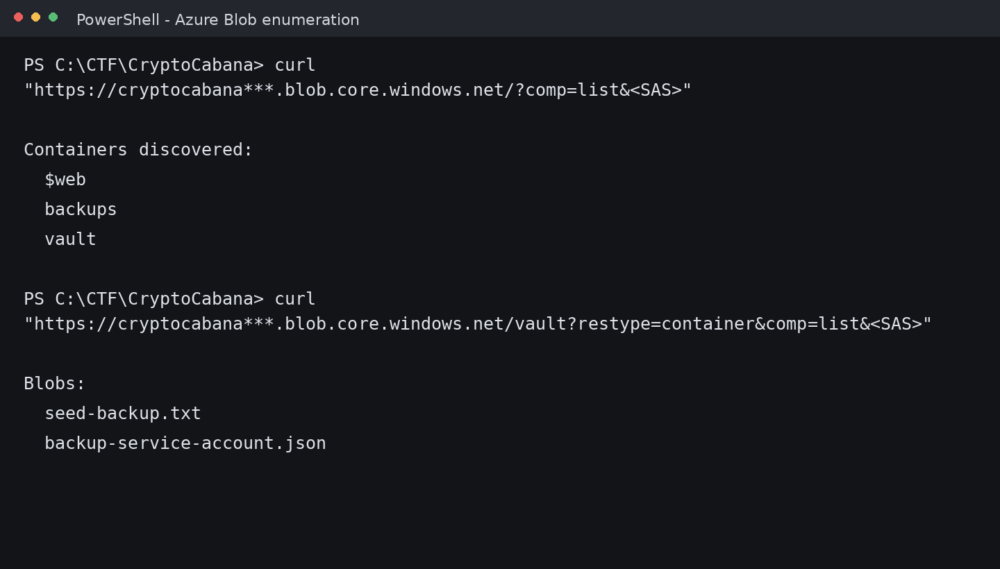
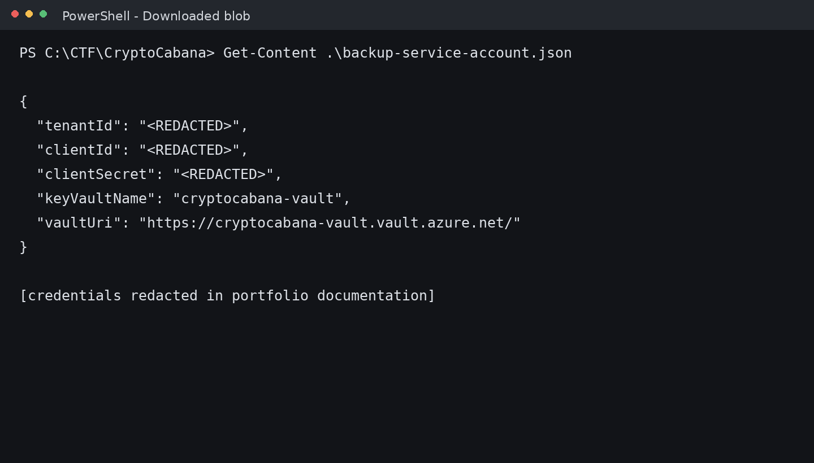
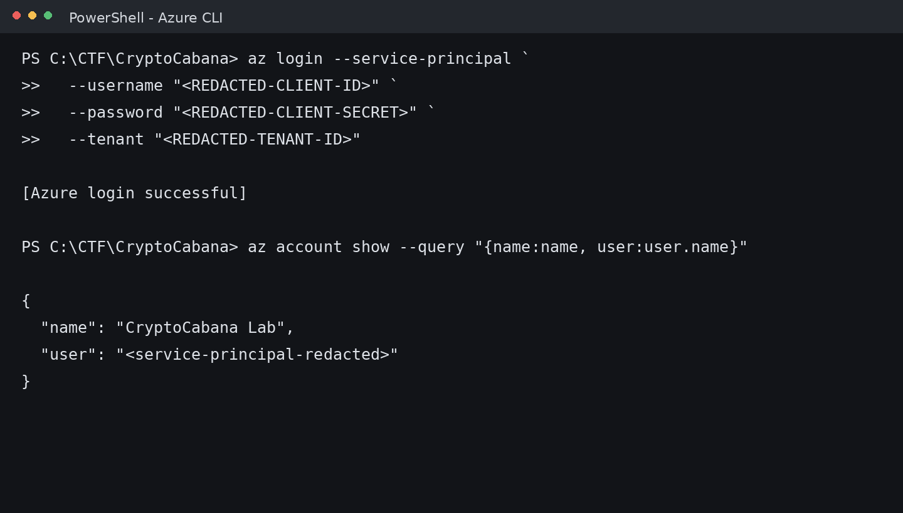
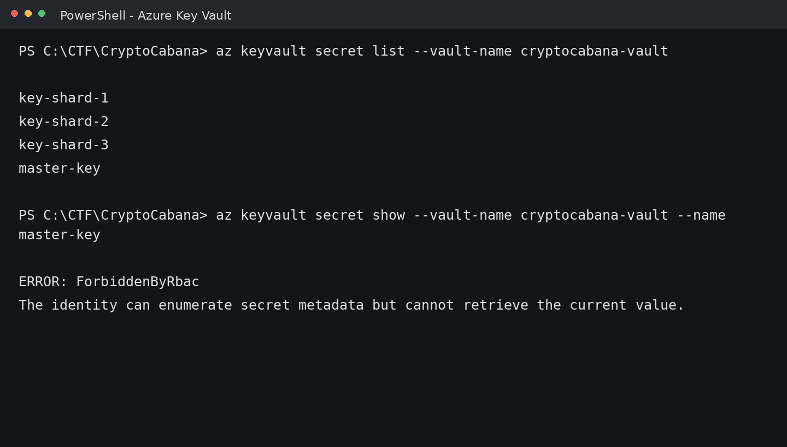
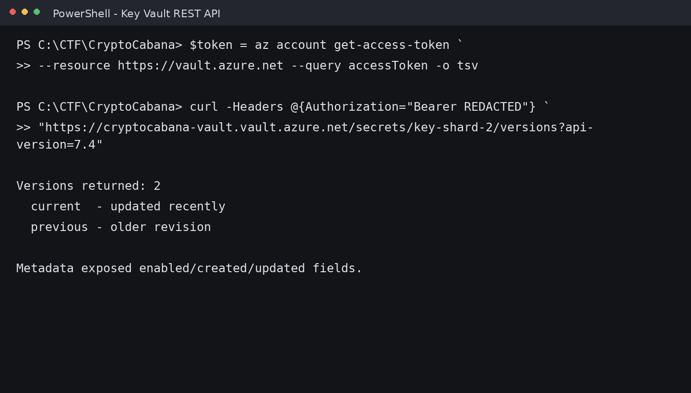
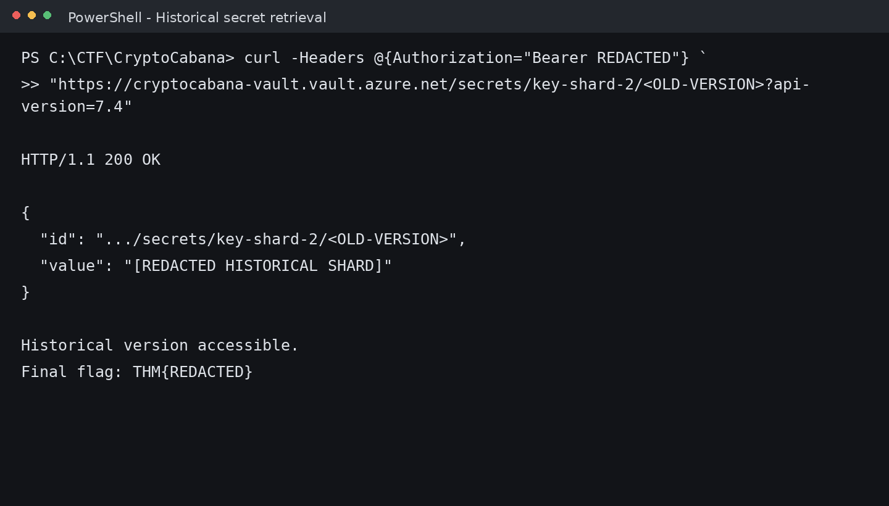

<div class="ctf-hero">

<h1>CryptoCabana</h1>

<p>
  A professional Microsoft Azure cloud security assessment demonstrating how
  multiple Azure misconfigurations can be chained from a publicly accessible
  static website to Azure Storage, a Service Principal identity, Azure Key Vault,
  and historical secret recovery.
</p>

<div class="ctf-badges">
  <span class="ctf-badge">TryHackMe</span>
  <span class="ctf-badge">Azure</span>
  <span class="ctf-badge">Cloud Security</span>
  <span class="ctf-badge">Medium</span>
</div>

</div>

<figure>
  
  <figcaption>
    Figure — Initial CryptoCabana application used for cloud security reconnaissance.
  </figcaption>
</figure>

---

# Mission

**CryptoCabana** is a cloud-focused Microsoft Azure security challenge that demonstrates how several Azure authorization and configuration weaknesses can be chained into a complete compromise.

The assessment begins with a publicly accessible **Azure Static Website** and progresses through:

- Azure Storage enumeration
- Client-side JavaScript analysis
- Shared Access Signature analysis
- Azure Blob Storage container discovery
- Service Principal credential exposure
- Microsoft Entra authentication
- Azure Key Vault investigation
- RBAC analysis
- Azure REST API enumeration
- Historical secret version recovery

This portfolio edition presents the documented assessment from a penetration-testing and cloud-security perspective while intentionally preserving the source documentation's redactions of challenge secrets and sensitive cloud credentials.

> **Portfolio Edition**
>
> Challenge flags, SAS signatures, Azure Client Secrets, OAuth access tokens, Tenant IDs, Subscription IDs, secret values, and historical secret shards have been intentionally removed or redacted where identified by the original documentation.

---

# Quick Overview

<div class="ctf-card-grid">

<div class="ctf-card">
  <div class="ctf-card-title">Platform</div>
  <div class="ctf-card-value">TryHackMe</div>
</div>

<div class="ctf-card">
  <div class="ctf-card-title">Challenge</div>
  <div class="ctf-card-value">CryptoCabana</div>
</div>

<div class="ctf-card">
  <div class="ctf-card-title">Difficulty</div>
  <div class="ctf-card-value">Medium</div>
</div>

<div class="ctf-card">
  <div class="ctf-card-title">Primary Focus</div>
  <div class="ctf-card-value">Microsoft Azure Cloud Security</div>
</div>

<div class="ctf-card">
  <div class="ctf-card-title">Environment</div>
  <div class="ctf-card-value">Azure Static Website / Storage / Key Vault</div>
</div>

<div class="ctf-card">
  <div class="ctf-card-title">Assessment Type</div>
  <div class="ctf-card-value">Cloud Penetration Testing</div>
</div>

</div>

---
## Navigation
<div class="ctf-toc">

  <div class="ctf-toc-title">Navigation</div>

  <ul>
    <li><a href="#mission">Mission</a></li>
    <li><a href="#quick-overview">Quick Overview</a></li>
    <li><a href="#assessment-objectives">Assessment Objectives</a></li>
    <li><a href="#target-and-lab-information">Target and Lab Information</a></li>
    <li><a href="#attack-surface">Attack Surface</a></li>
    <li><a href="#azure-attack-chain">Azure Attack Chain</a></li>
    <li><a href="#azure-architecture-overview">Azure Architecture Overview</a></li>
    <li><a href="#assessment-timeline">Assessment Timeline</a></li>
    <li><a href="#phase-1--azure-static-website-reconnaissance">Phase 1 — Azure Static Website Reconnaissance</a></li>
    <li><a href="#phase-2--client-side-javascript-analysis">Phase 2 — Client-side JavaScript Analysis</a></li>
    <li><a href="#phase-3--sas-token-permission-analysis">Phase 3 — SAS Token Permission Analysis</a></li>
    <li><a href="#phase-4--azure-blob-storage-enumeration">Phase 4 — Azure Blob Storage Enumeration</a></li>
    <li><a href="#phase-5--service-principal-exposure">Phase 5 — Service Principal Exposure</a></li>
    <li><a href="#phase-6--azure-cli-authentication">Phase 6 — Azure CLI Authentication</a></li>
    <li><a href="#phase-7--azure-key-vault-investigation">Phase 7 — Azure Key Vault Investigation</a></li>
    <li><a href="#phase-8--azure-rest-api-enumeration">Phase 8 — Azure REST API Enumeration</a></li>
    <li><a href="#phase-9--historical-secret-recovery">Phase 9 — Historical Secret Recovery</a></li>
    <li><a href="#azure-trust-relationship-analysis">Azure Trust Relationship Analysis</a></li>
    <li><a href="#security-findings">Security Findings</a></li>
    <li><a href="#mitre-attck-techniques">MITRE ATT&amp;CK Techniques</a></li>
    <li><a href="#tools-and-technologies">Tools and Technologies</a></li>
    <li><a href="#key-findings">Key Findings</a></li>
    <li><a href="#defensive-recommendations">Defensive Recommendations</a></li>
    <li><a href="#skills-demonstrated">Skills Demonstrated</a></li>
    <li><a href="#lessons-learned">Lessons Learned</a></li>
    <li><a href="#repository-resources">Repository Resources</a></li>
    <li><a href="#references">References</a></li>
    <li><a href="#responsible-use">Responsible Use</a></li>
    <li><a href="#portfolio-disclaimer">Portfolio Disclaimer</a></li>
  </ul>

</div>

---

# Assessment Objectives

The assessment focuses on two complementary areas: **Azure cloud security** and **security investigation methodology**.

| Cloud Security Goals | Investigation Goals |
|---|---|
| Azure Storage Enumeration | Client-side Reconnaissance |
| SAS Token Analysis | RBAC Analysis |
| Blob Container Discovery | REST API Enumeration |
| Azure Identity Investigation | Secret Version Discovery |
| Azure Key Vault Enumeration | Cloud Trust Chain Analysis |

The documented workflow demonstrates how authorization artifacts, cloud identities, storage resources, and secret lifecycle controls can interact across an Azure environment.

---

# Target and Lab Information

The documented target is a publicly accessible Azure-hosted cryptocurrency backup application.

The assessment environment contains the following documented components:

| Component | Documented Role |
|---|---|
| Azure Static Website | Public-facing application |
| JavaScript frontend | Exposes Azure Storage configuration |
| Azure Blob Storage Account | Stores application and backup resources |
| `$web` container | Static website content |
| `backups` container | Backup-related resources |
| `vault` container | Hidden storage resource discovered during enumeration |
| Service Principal | Backend automation identity |
| Microsoft Entra ID | Cloud identity and authentication layer |
| Azure Key Vault | Secret storage |
| Azure REST API | Secret metadata and version enumeration |

No target IP address, hostname, network port, or subscription identifier was documented in the supplied source material.

---

# Attack Surface

The documented attack surface is primarily cloud and application-layer rather than traditional network-service enumeration.

| Attack Surface | Observation | Security Relevance |
|---|---|---|
| Azure Static Website | Publicly accessible | Provides initial reconnaissance point |
| Client-side JavaScript | Azure Storage configuration exposed | Reveals cloud authorization information |
| SAS authorization | Read and list permissions available | Enables Azure Storage enumeration |
| Blob Storage | Multiple containers discoverable | Exposes additional cloud resources |
| Hidden `vault` container | Not referenced by application | Expands accessible cloud attack surface |
| Administrative backup resource | Service Principal configuration exposed | Provides cloud authentication path |
| Microsoft Entra ID | Service Principal authentication | Establishes authenticated Azure identity |
| Azure Key Vault | Secret metadata accessible | Exposes secret lifecycle information |
| Secret versions | Historical versions enumerable | Creates historical secret exposure |

---

# Azure Attack Chain

## Complete Cloud Compromise Path

<div class="attack-chain">

<div class="attack-step">Public Azure Website</div>

<div class="attack-arrow">→</div>

<div class="attack-step">JavaScript Configuration Leak</div>

<div class="attack-arrow">→</div>

<div class="attack-step">SAS Exposure</div>

<div class="attack-arrow">→</div>

<div class="attack-step">Blob Enumeration</div>

<div class="attack-arrow">→</div>

<div class="attack-step">Hidden Container</div>

<div class="attack-arrow">→</div>

<div class="attack-step">Service Principal</div>

<div class="attack-arrow">→</div>

<div class="attack-step">Microsoft Entra Authentication</div>

<div class="attack-arrow">→</div>

<div class="attack-step">Azure Key Vault</div>

<div class="attack-arrow">→</div>

<div class="attack-step">Secret Version Enumeration</div>

<div class="attack-arrow">→</div>

<div class="attack-step">Historical Secret Recovery</div>

</div>

The documented attack path demonstrates a progression from **public application reconnaissance** to **cloud resource enumeration**, followed by **identity abuse** and **secret lifecycle analysis**.

---

# Azure Architecture Overview

```text
                       Internet
                          │
                          ▼
              Azure Static Website ($web)
                          │
                   app.js exposes SAS
                          │
                          ▼
            Azure Blob Storage Account
            ├──────── backups
            ├──────── $web
            └──────── vault
                          │
                          ▼
           backup-service-account.json
                          │
                          ▼
            Azure Service Principal
                          │
                          ▼
               Azure Key Vault
        ├── key-shard-1
        ├── key-shard-2
        ├── key-shard-3
        └── master-key
                          │
                          ▼
          Historical Secret Version
```

The architecture illustrates how the individual Azure components form a trust relationship that can be traversed when authorization artifacts and credentials are exposed.

---

# Assessment Timeline

| Phase | Assessment Activity |
|---|---|
| **01** | Azure Static Website reconnaissance |
| **02** | Client-side JavaScript analysis |
| **03** | Shared Access Signature permission review |
| **04** | Azure Blob Storage container enumeration |
| **05** | Hidden vault container discovery |
| **06** | Azure Service Principal authentication |
| **07** | Azure Key Vault RBAC investigation |
| **08** | Azure REST API metadata enumeration |
| **09** | Historical secret version recovery |

---

# Phase 1 — Azure Static Website Reconnaissance

The assessment begins by inspecting a publicly accessible Azure Static Website hosting a cryptocurrency backup application.

The initial reconnaissance identifies:

- Static HTML interface
- JavaScript-based storage operations
- No authentication barrier
- Azure-hosted frontend

<figure>
  
  <figcaption>
    Figure 1 — Initial reconnaissance against the CryptoCabana application.
  </figcaption>
</figure>

The public application provides the starting point for identifying how the frontend interacts with Azure cloud resources.

---

# Phase 2 — Client-side JavaScript Analysis

Inspection of the frontend JavaScript reveals Azure Storage configuration embedded directly into client-side code.

## Key Findings

The documented configuration exposes:

- Storage Account Name
- Blob Container
- Blob Endpoint
- Shared Access Signature

<figure>
  
  <figcaption>
    Figure 2 — JavaScript exposing Azure Storage configuration (sanitized).
  </figcaption>
</figure>

<div class="key-finding">

<div class="key-finding-title">Key Finding</div>

Authorization artifacts embedded into frontend applications increase the cloud attack surface because client-side resources are accessible to users and can expose information intended for backend operations.

</div>

The exposed configuration becomes the basis for subsequent Azure Storage investigation.

---

# Phase 3 — SAS Token Permission Analysis

The exposed Shared Access Signature contains delegated permissions for Azure Storage operations.

| Permission | Meaning |
|---|---|
| **Read** | Blob contents accessible |
| **List** | Container enumeration allowed |

Upload operations are denied by Azure authorization.

<figure>
  
  <figcaption>
    Figure 3 — Authorization boundary verification using Azure Storage.
  </figcaption>
</figure>

The important security distinction is that the authorization artifact does not provide unrestricted storage access. However, its documented **read and list permissions** are sufficient to enumerate accessible Azure Storage resources.

---

# Phase 4 — Azure Blob Storage Enumeration

Using the delegated SAS authorization, Azure Blob Storage becomes enumerable.

The documented containers include:

- `$web`
- `backups`
- `vault`

The **`vault`** container is particularly significant because it is never referenced by the application.

<figure>
  
  <figcaption>
    Figure 4 — Azure Blob Storage enumeration revealing hidden resources.
  </figcaption>
</figure>

<div class="key-finding">

<div class="key-finding-title">Key Finding</div>

A storage resource that is not referenced by the public application is nevertheless discoverable through the available delegated authorization. This expands the effective cloud attack surface beyond the application's intended functionality.

</div>

---

# Phase 5 — Service Principal Exposure

The hidden administrative container stores an Azure Service Principal configuration used by backend automation.

<figure>
  
  <figcaption>
    Figure 5 — Service Principal configuration recovered from Blob Storage (redacted).
  </figcaption>
</figure>

## Why This Matters

Service Principals authenticate applications directly into Microsoft Azure.

Exposing their credentials creates a legitimate cloud authentication path and changes the assessment from unauthenticated resource enumeration to authenticated Azure identity investigation.

<div class="key-finding">

<div class="key-finding-title">Key Finding</div>

The hidden administrative storage resource exposes a Service Principal configuration, providing credentials that can be used to authenticate into the documented Azure environment.

</div>

---

# Phase 6 — Azure CLI Authentication

The recovered Service Principal authenticates successfully into Azure.

<figure>
  
  <figcaption>
    Figure 6 — Successful Azure CLI authentication using the recovered workload identity.
  </figcaption>
</figure>

## Validation

The documented authentication results include:

- Tenant context confirmed
- OAuth token issued
- Subscription context available
- Azure resources accessible

The Service Principal therefore establishes an authenticated cloud identity that can be used for further resource and authorization analysis.

---

# Phase 7 — Azure Key Vault Investigation

The authenticated identity can enumerate Azure Key Vault secrets but cannot retrieve current secret values.

<figure>
  
  <figcaption>
    Figure 7 — Azure Key Vault RBAC authorization boundary.
  </figcaption>
</figure>

## Accessible Metadata

The documented metadata includes:

- Secret Names
- Secret Tags
- Creation Timestamps
- Update Timestamps
- Version Metadata

Current secret values remain protected.

This stage demonstrates an important distinction between **metadata access** and **secret-value access**. The identity does not have unrestricted permission to retrieve current values, but the available metadata provides information about the secret lifecycle.

---

# Phase 8 — Azure REST API Enumeration

Azure REST APIs expose additional metadata describing Key Vault secret lifecycle events.

<figure>
  
  <figcaption>
    Figure 8 — Secret version metadata enumeration through Azure REST API.
  </figcaption>
</figure>

## Metadata Investigation

The documented investigation identifies:

- Version IDs
- Secret Rotation Timeline
- Secret Attributes
- Version Count

The existence of multiple versions becomes important because the current secret value is protected while historical versions remain part of the secret's lifecycle.

---

# Phase 9 — Historical Secret Recovery

A previous version of a rotated secret remains accessible.

<figure>
  
  <figcaption>
    Figure 9 — Historical secret version recovery (sanitized).
  </figcaption>
</figure>

## Final Result

The historical shard replaces the rotated value and allows local reconstruction of the room secret.

> **Room flag intentionally removed.**

<div class="key-finding">

<div class="key-finding-title">Key Finding</div>

Secret rotation alone does not eliminate historical exposure when previous secret versions remain accessible through the documented authorization path.

</div>

---

# Azure Trust Relationship Analysis

The documented trust chain can be represented as:

```text
Browser
  │
  ▼
Shared Access Signature
  │
  ▼
Azure Blob Storage
  │
  ▼
Administrative Container
  │
  ▼
Service Principal
  │
  ▼
Microsoft Entra ID
  │
  ▼
Azure Key Vault
```

The significance of this chain is that no single component exists in isolation.

The initial exposure of a cloud authorization artifact enables storage enumeration. Storage enumeration reveals an administrative resource. That resource exposes a cloud identity, which then provides authenticated access to another Azure service. Key Vault metadata and historical secret versions subsequently provide additional information.

This demonstrates why cloud trust boundaries must be secured **end-to-end**, rather than treating individual services as isolated security boundaries.

---

# Security Findings

| Finding | Severity |
|---|---|
| Client-side SAS Token Exposure | <span class="severity severity-high">High</span> |
| Hidden Blob Container Enumeration | <span class="severity severity-high">High</span> |
| Service Principal Credential Exposure | <span class="severity severity-critical">Critical</span> |
| Key Vault Metadata Enumeration | <span class="severity severity-medium">Medium</span> |
| Historical Secret Version Exposure | <span class="severity severity-high">High</span> |

## Finding Summary

### Client-side SAS Token Exposure

A Shared Access Signature is exposed through client-side application code and provides documented read and list permissions against Azure Storage.

### Hidden Blob Container Enumeration

The delegated authorization allows discovery of a `vault` container that is not referenced by the public application.

### Service Principal Credential Exposure

The hidden administrative container contains Service Principal configuration used by backend automation, creating a valid Azure authentication path.

### Key Vault Metadata Enumeration

The authenticated identity can enumerate secret metadata and version information despite not being able to retrieve current secret values.

### Historical Secret Version Exposure

A previous version of a rotated secret remains accessible, enabling recovery of a historical shard used in the documented challenge flow.

---

# MITRE ATT&CK Techniques

The following mappings are preserved from the original CTF documentation.

| Technique | ID | Evidence |
|---|---|---|
| Unsecured Credentials | **T1552** | Service Principal configuration and cloud credential exposure |
| Steal Application Access Token | **T1528** | Documented OAuth/cloud authentication path |
| Cloud Service Discovery | **T1526** | Azure Storage and cloud resource enumeration |
| Valid Accounts | **T1078** | Authentication using the recovered Service Principal |
| Account Discovery | **T1087** | Documented cloud identity investigation |
| Use of Stolen Credentials | **T1550** | Use of recovered Service Principal credentials |

These mappings are included because they were explicitly present in the source documentation.

---

# Tools and Technologies

The source documentation identifies the following technologies and interfaces as part of the assessment workflow.

<div class="tool-list">

<span class="tool-tag">Microsoft Azure</span>
<span class="tool-tag">Azure Blob Storage</span>
<span class="tool-tag">Azure Key Vault</span>
<span class="tool-tag">Microsoft Entra ID</span>
<span class="tool-tag">Azure CLI</span>
<span class="tool-tag">Azure REST APIs</span>
<span class="tool-tag">RBAC</span>

</div>

| Tool / Technology | Documented Purpose |
|---|---|
| **Microsoft Azure** | Cloud environment under assessment |
| **Azure Blob Storage** | Storage enumeration and resource discovery |
| **Azure Key Vault** | Secret and secret-version investigation |
| **Microsoft Entra ID** | Cloud identity authentication |
| **Azure CLI** | Service Principal authentication and Azure resource access |
| **Azure REST APIs** | Key Vault metadata and secret-version enumeration |
| **Azure RBAC** | Authorization analysis |

No additional security tools are introduced beyond those documented in the source material.

---

# Key Findings

<div class="key-finding">

<div class="key-finding-title">01 — Client-side Authorization Exposure</div>

The frontend exposes Azure Storage configuration containing a Shared Access Signature. Client-side authorization artifacts can significantly expand the attack surface when their permissions allow resource discovery or data access.

</div>

<div class="key-finding">

<div class="key-finding-title">02 — Hidden Cloud Resources Are Discoverable</div>

The `vault` Blob Storage container is not referenced by the application but becomes discoverable through the available delegated Storage authorization.

</div>

<div class="key-finding">

<div class="key-finding-title">03 — Administrative Identity Exposure</div>

The hidden administrative container contains a Service Principal configuration, providing a legitimate authentication mechanism into Azure.

</div>

<div class="key-finding">

<div class="key-finding-title">04 — Metadata Can Extend an Attack Path</div>

Key Vault secret values remain protected, but secret names, tags, timestamps, attributes, and version metadata remain accessible and provide useful information about the secret lifecycle.

</div>

<div class="key-finding">

<div class="key-finding-title">05 — Historical Secret Versions Matter</div>

A previous version of a rotated secret remains accessible and contributes to the final documented secret-recovery path.

</div>

---

# Defensive Recommendations

The recommendations below are derived directly from the documented security findings.

## Azure Storage

- Avoid embedding SAS tokens inside frontend code.
- Use least-privilege SAS permissions.
- Restrict SAS expiration windows.
- Separate administrative storage from public assets.

## Azure Identity

- Replace Service Principals with Managed Identities.
- Rotate exposed credentials immediately.
- Store secrets only inside Azure Key Vault.

## Azure Key Vault

- Review RBAC assignments regularly.
- Audit secret metadata permissions.
- Remove obsolete secret versions after rotation.

## Monitoring

Enable alerts for the documented activity areas:

- Blob container enumeration
- Service Principal sign-ins
- Secret version enumeration
- Azure Key Vault metadata access

---

# Skills Demonstrated

<table>
<tr>
<th>Cloud Security</th>
<th>Offensive Security</th>
</tr>

<tr>
<td>

<ul>
<li>Azure Storage</li>
<li>Blob Storage</li>
<li>Key Vault</li>
<li>Microsoft Entra ID</li>
<li>RBAC</li>
<li>Azure REST APIs</li>
</ul>

</td>

<td>

<ul>
<li>Client-side Reconnaissance</li>
<li>Storage Enumeration</li>
<li>Cloud Identity Abuse</li>
<li>Secret Discovery</li>
<li>Metadata Enumeration</li>
<li>Trust Chain Analysis</li>
</ul>

</td>
</tr>
</table>

---

# Lessons Learned

## 1. Client-side configuration is part of the cloud attack surface

Cloud security assessments should include inspection of frontend JavaScript and other client-accessible resources. Authorization artifacts exposed to users must be treated as potentially discoverable.

## 2. Authorization should be evaluated by effective permissions

A token does not need unrestricted access to create security impact. The documented read and list permissions were sufficient to enumerate Azure Storage resources.

## 3. Hidden resources are not necessarily protected resources

The `vault` container was not referenced by the application, but it was still discoverable through the available storage authorization.

## 4. Cloud identities create trust relationships

The exposed Service Principal transformed storage-level access into an authenticated Azure identity, demonstrating the importance of protecting workload credentials.

## 5. Metadata can provide valuable security intelligence

Even when current secret values cannot be retrieved, secret names, timestamps, attributes, and version information can reveal details about the underlying secret lifecycle.

## 6. Secret rotation must account for historical versions

The documented challenge demonstrates that rotating a secret does not automatically eliminate historical exposure when previous versions remain accessible.

---

# Repository Resources

| File | Description |
|---|---|
| **README.md** | Repository overview and walkthrough summary |
| **Documentation/Documentation.md** | Complete technical assessment report |
| **Resources/notes.md** | Azure security notes and pentesting cheatsheet |
| **Screenshots/** | Evidence collected during the assessment |

---

# References

The original documentation identifies the following references:

- TryHackMe — CryptoCabana
- Microsoft Learn — Azure Storage SAS Tokens
- Microsoft Learn — Azure Blob Storage REST API
- Microsoft Learn — Azure Key Vault
- Microsoft Learn — Azure RBAC

No additional external references have been introduced.

---

# Responsible Use

> This documentation was created for authorized cybersecurity training and CTF environments. Techniques described here should only be used against systems for which you have explicit permission to test.

The documented activities are presented in the context of the authorized TryHackMe laboratory environment.

---

# Portfolio Disclaimer

This repository documents an **authorized TryHackMe cloud security lab** completed for cybersecurity education and portfolio development.

The following items have been intentionally removed or redacted:

- ❌ TryHackMe Flag
- ❌ SAS Token Signature
- ❌ Azure Client Secret
- ❌ OAuth Access Tokens
- ❌ Tenant ID
- ❌ Subscription ID
- ❌ Secret Values
- ❌ Historical Secret Shards

The repository demonstrates **cloud penetration testing methodology and Azure security analysis** without publishing challenge secrets.

---

# Portfolio Takeaway

CryptoCabana demonstrates a practical Azure cloud attack chain in which seemingly separate weaknesses can compound:

```text
Public Application
        ↓
Client-side Configuration Exposure
        ↓
SAS Authorization
        ↓
Blob Storage Enumeration
        ↓
Hidden Administrative Resource
        ↓
Service Principal Exposure
        ↓
Azure Authentication
        ↓
Key Vault Metadata Enumeration
        ↓
Historical Secret Version Exposure
```

The central security lesson is that **cloud security depends on protecting the entire trust chain** — from public application code and delegated storage authorization through workload identities, RBAC permissions, and secret lifecycle management.

---

# Conclusion

CryptoCabana provides a practical demonstration of Azure cloud security assessment methodology.

The documented investigation progresses from **public application reconnaissance** to **client-side configuration analysis**, **SAS permission analysis**, **Blob Storage enumeration**, **Service Principal authentication**, **Key Vault RBAC investigation**, **REST API metadata enumeration**, and finally **historical secret recovery**.

From a defensive perspective, the assessment highlights the importance of:

- least-privilege authorization
- secure handling of SAS tokens
- protection of workload identities
- separation of public and administrative storage
- careful RBAC design
- monitoring of cloud identity activity
- controlled secret lifecycle management
- removal or invalidation of obsolete secret versions

The assessment ultimately demonstrates how individual cloud-security weaknesses can combine into a much larger compromise path when trust boundaries are not consistently enforced.

---

<div class="ctf-footer">

<strong>CYBERSECURITY CTF PORTFOLIO</strong>

<br>

Research • Practice • Detection • Defense

<br><br>

© Anurag R.

</div>
